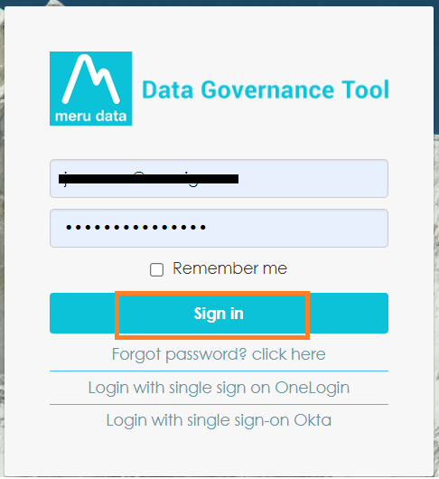
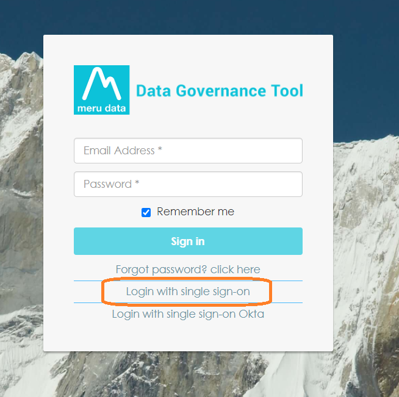
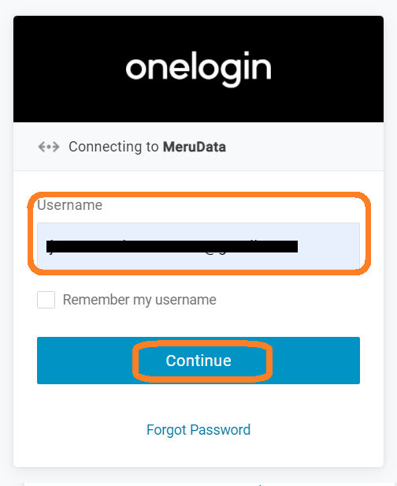
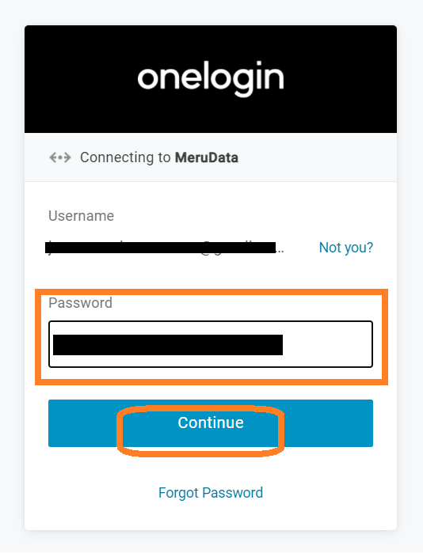
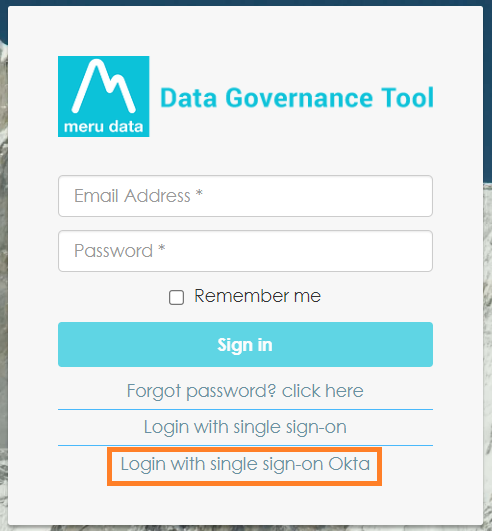
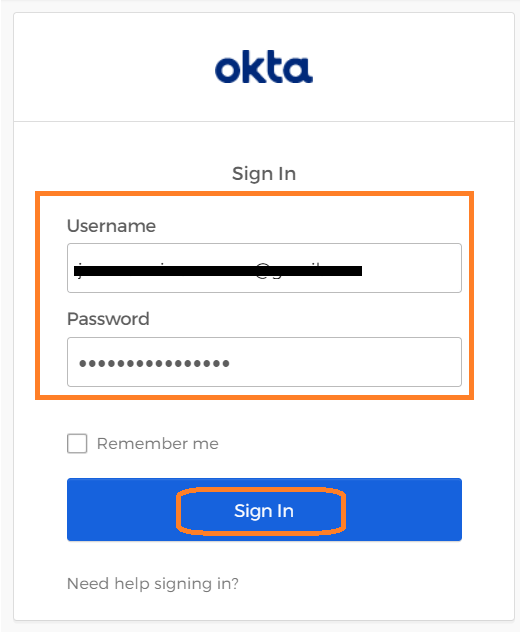

  

[Back](../../GetStarted.md)

# Accessing Data Governance Tool

> ### *Are you having trouble accessing your account ? Learn more about signing in to your Meru account.*
&nbsp;

> ## Methods to LogIn to Meru Data Governance Tool

### **1. Standard Login**
### **2. Login with single sign-on OneLogin**
### **3. Login with a single sign-on Okta**

&nbsp;

>## **1. Standard Login**

1. Go to the Data Governance Tool site

2. The Meru Data Governance Tool Login Page will ask for your username and password

    ***Note :*** *Make sure you have your username and password* 

    

      
    

3. Enter your login credential and click sign in 

    

      
    

4. You will be directed to a Meru Data Governance Tool Home Page.

    

      
    

&nbsp;
&nbsp;

# Alternate Log-in Methods

## Data Governance Tool offers two additional sign-in options with  

### **1. Single sign on OneLogin**
  
### **2. Single sign on Okta**

&nbsp;

>## **1. Single sign on OneLogin**

&nbsp;

1. Go to the Data Governance Tool site

    

      
    

2. Below the blue sign in box, you will see the following :

    - Forgot password? Click here  
    - Login with single sign on OneLogin 
    - Login with single sign on Okta  

3. Select the second option, '**Login with single sign on OneLogin**' 

    

      
    

4. The single sign on OneLogin page will open

5. Type in your username and click on 'Continue'

    

      
    

6. Next type in your Password and click on 'Continue'

    

      
    

7. You will now find yourself signed in to Data Governance Tool and will be viewing its Main Screen

    

      
    

&nbsp;

>## **2. Single sign on Okta**

&nbsp;

1. Go to the Data Governance Tool site

    

      
    

2. Below the blue sign in box, you will see the following : -  
    - Forgot password? Click here  
    - Login with single sign on OneLogin 
    - Login with single sign on Okta

    
3. Select the last option, '**Login with single sign on Okta**' 

    

      
    

4. The single sign on Okta page will open

5. Type in your username and password and then click ‘Sign in’  

6. Click Sign In

    

      
    

7. You will now find yourself signed in to Data Governance Tool and will be viewing its Main Screen

    

      
    

&nbsp;
