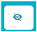
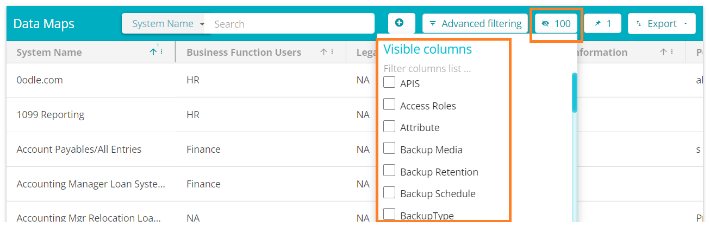
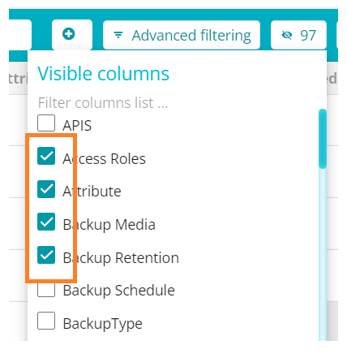

  

[Back](../../GetStarted.md)

# Adding and Removing fields from Table View

> ### *This article will cover all information regarding adding and removing fields from the table / Grid view.*
&nbsp;

1. From the Data Governance Tool Main Screen, click on **Menu**  , on the top left of your screen.

2. Under Menu, select any of the product which has table view / Based on your requirement. For example, DataMaps 
    
    

      
    

3. On the DataMaps Screen, click on System Names to view the table of System Names and their fields 
    
    

      
    

4. Click on the  to open a list of all possible columns/fields  
    
    

      
    

5. Check the box to add the required field, uncheck the box to remove the required field.
    
    

      
    
