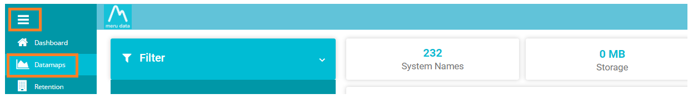
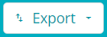

  

[Back](../../GetStarted.md)

# Export Data from Grid

> ### *This article will demonstrate how to Export data from the Table / Grid*
&nbsp;

1. From the Data Governance Tool Main Screen, click on **Menu**  , on the top left of your screen.

2. Under Menu, select the second option – DataMaps
 
    

      
    

3. On the DataMaps Screen, click on System Names to view the table of System Names and their fields
   
    

      
    

4. On clicking on the Export Button  on the right of the screen a drop-down table will appear with the option – To Excel and To CSV 

5. Select format required to export the data in either Excel or CSV
   
    

      
    

 