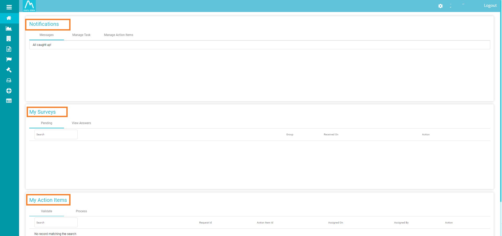
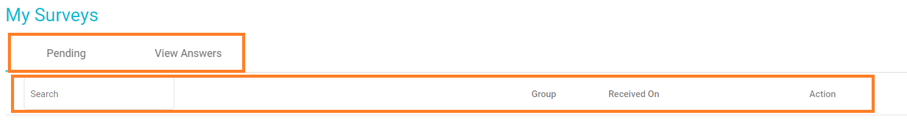
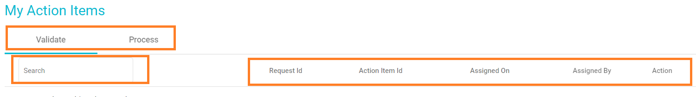
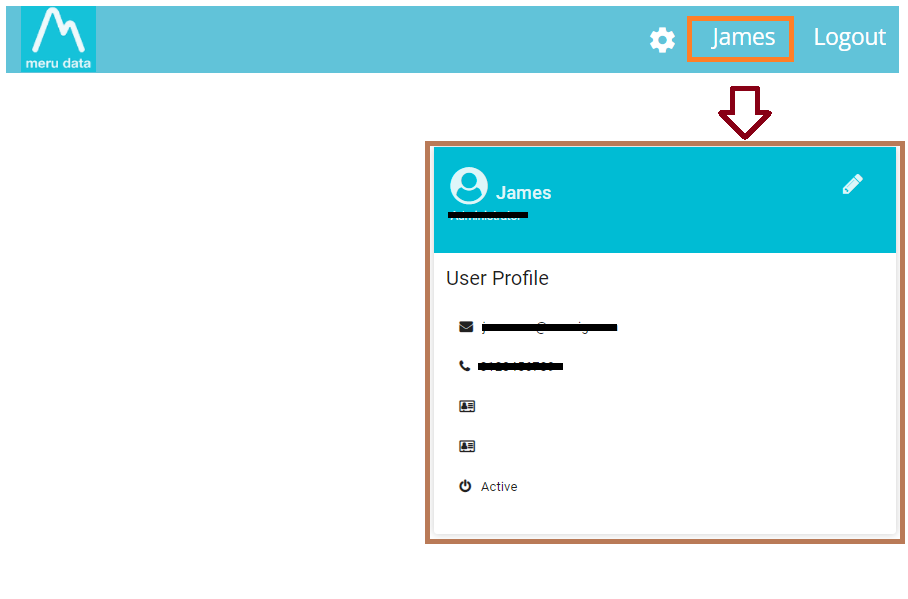

  

[Back](../../GetStarted.md)

# Navigation

> ### *This article will act as a navigation guide to Meru Data Governance Tool*
&nbsp;

1. Go to the Data Governance Tool site

2. Fill in your login details - your email ID and password. 

3. Once logged in, on the main screen, you will be able to view 3 main lists: Notifications, My Surveys and My Action Items.  

    

      
    

4. Notifications will include Messages, the option to Manage tasks and the option to Manage Action Items.

    

      
    

5. My Surveys will include all the surveys sent to system users as well as the answers/responses to them. This can easily be accessed from the dashboard.  

    

      
    

6. My Action Items include DSAR requests and other pending tasks, their details, as well as their status.

    

      
    

7. The Main Screen also provides access to various other screens which are

- Dashboard
- Datamaps
- Retention
- Survey
- Risk Register
- Legal Hold
- DefensiveDeletion
- DSA request
- Reports 

8. On the top right of the Main Screen, there is 

    - Settings Icon  ,Comes with multiple options based on your role ( Administrator / User)

    - Your Username, which upon clicking will lead you to your Profile settings

      

        
      

    - The option to log out of the Data Governance tool.
    
       

        
      

