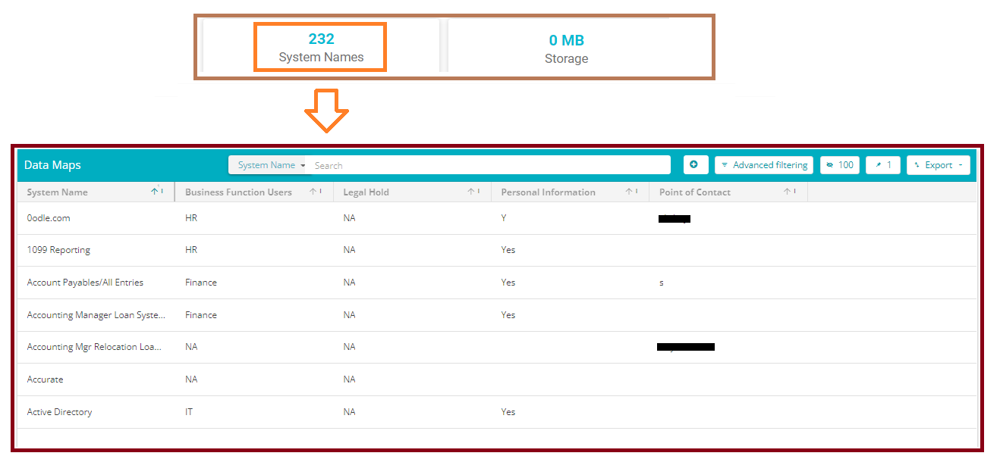
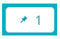
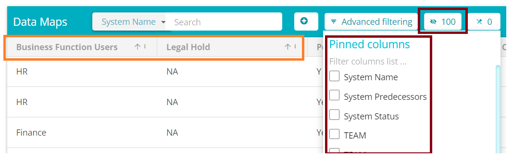
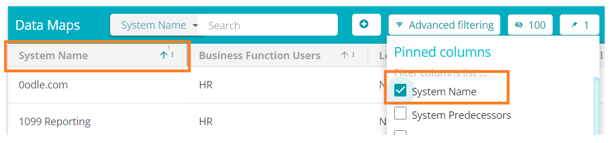

  

[Back](../../GetStarted.md)

# Pinning Fields in Table View

> ### *This article will demonstrate how to lock fields in the table / Grid view*
&nbsp;

1.  From the Data Governance Tool Main Screen, click on **Menu**  , on the top left of your screen.  

2. Under Menu, select the second option – DataMaps
 
    

      
    

3. On the DataMaps Screen, click on System Names to view the table of System Names and their fields 
  
    

      
    

4. Click on the  to open a list of all possible columns/fields  
  
    

      
    

5. Check the box to pin the required field, uncheck the box to unpin the required field as per your preference. Pinning a field will bring it to the front of the columns, making it easily accessible. 
  
    

      
    

