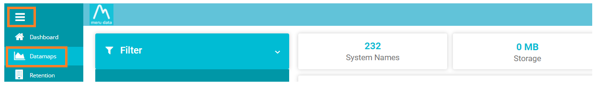
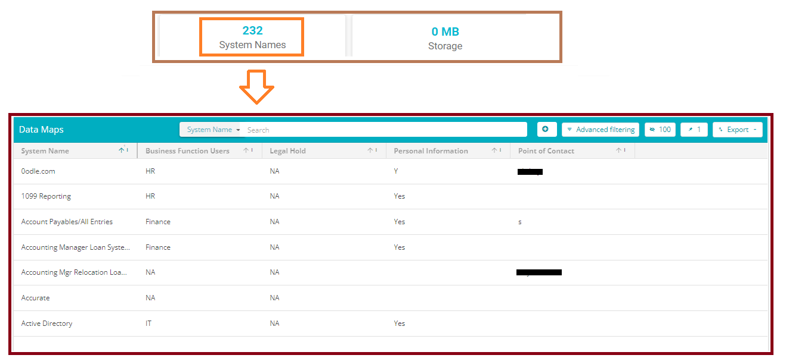
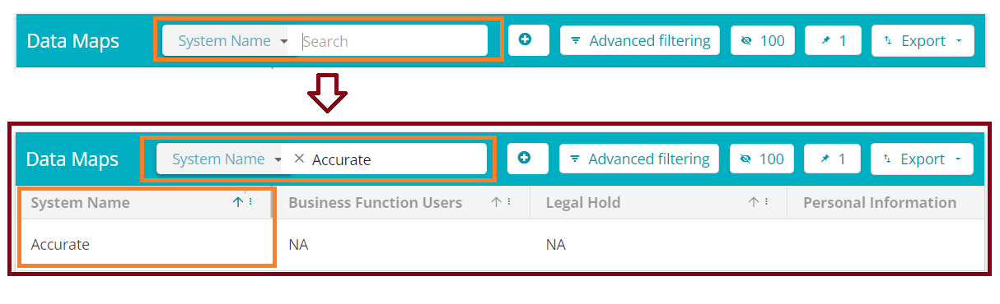
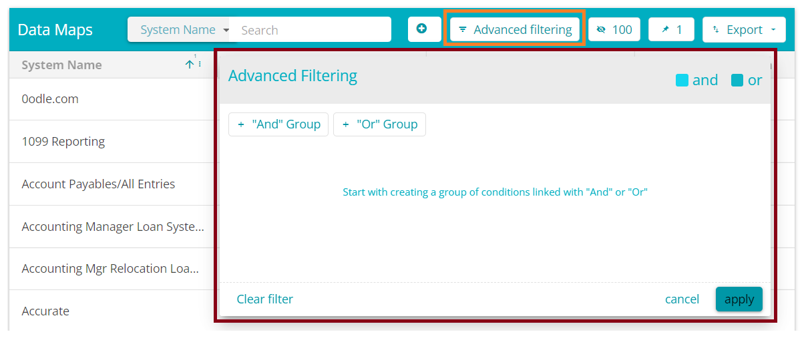
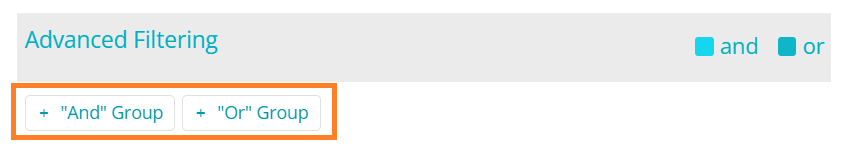
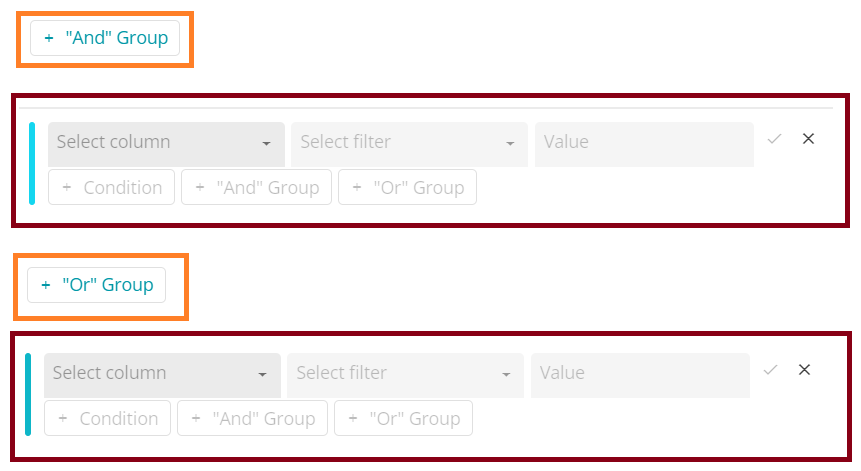

  

[Back](../../GetStarted.md)

# Search and Advanced Filtering

> ### *This article will demonstrate how to search for a text within any of the fields across all pages as well as how to conduct more advanced searches using keywords*
&nbsp;

1. From the Data Governance Tool Main Screen, click on **Menu**  , on the top left of your screen.

2. Under Menu, select the second option – DataMaps
 
    

      
    

3. On the DataMaps Screen, click on System Names to view the table of System Names and their fields 
  
    

      
    

4. To search for any particular field or System Name, type it in the search bar using a keyword.  
  
    

      
    

5. To search for data in a specific field, click on Advanced Filtering  
  
    

      
    

6. Select either the '+"And" Group' or the '+"Or" Group' 
 
    

      
    

7. The '+"And" Group' satisfies all the conditions, while the '+"Or group' satisfies 1 condition at a time.  

    

      
    

8. From the table that appears, select a column, a filter and type in the value and click on the tick mark  

9. Click on apply  

10. The search in this case is restricted only to the specified field 

## Complex Criteria Search  

1. The Advanced Filtering allows you to search filter information further using complex search criteria like ‘=’ ‘starts with’ etc and can be paired with multiple ‘And’ ‘Or’ conditions. 

For example, if you’re searching for the data on Business Function Users - HR, select Business Function Users from the columns list, select the filter you want, like ‘Starts with’ and type in the value - here ‘h’ (HR). This will filter the data to show you HR as the Business Function Users.  
 

2. Select either the ‘+And Group’ or the ‘+Or Group’ 

3. From the table that appears, select a column, a filter and type in the value and click on the tick mark 

 