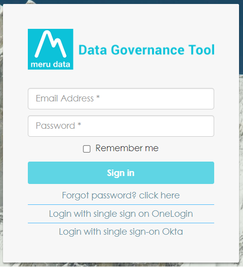
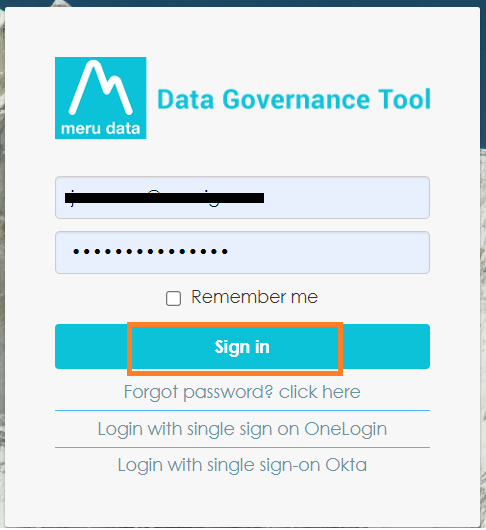
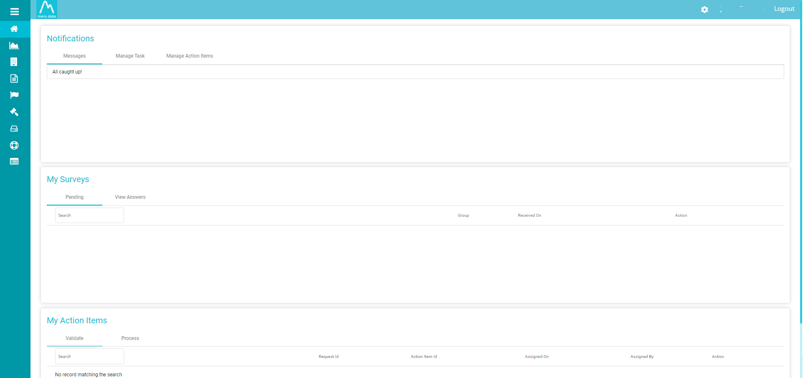
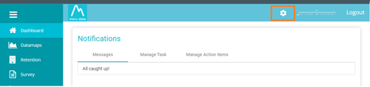

  

[Back](Admin_Guides.md)

# Assigning New Roles/Permissions 

### *This article will demonstrate how you can Assigning New Roles/Permissions within Data Governance Tool and how you edit existing Roles/Permissions.* 

1. Enter your Meru Data location on your browser address bar. You will be directed to the Meru Data Governance Tool login page 

    

    
    

2. Fill in your login details - your email ID and password 

    

      
    

3. Once you have filled in your details and successfully logged in, you will be viewing the Data Governance Tool Main Screen 

    

      
    

4. On the top right corner of the Main Screen there will be a ‘Settings’ icon  

    

      
    

5. On clicking the ‘Settings’ icon, a drop-down table will appear  

6. From the drop-down table, select the second option; Roles and Permissions 

    

        
    

7. The Roles and Permissions Page will display a list of all the existing User Groups, if any, as well as the option to edit and delete said groups 

    

      
    

8. When you click on an existing user group, The page will also show a Permissions List with check boxes for all the various Permissions available 

9. Click on ‘+Add Group’ on the top right of the Groups list  

    

      
    

10. In the pop-up box that appears, Type in the group name of your choice and click ‘Save’  

    

      
    

11. You will receive a message that reads, ‘User group added successfully’  

    

      
    

12. Once the Group has been created, select said group from the Group List and assign the permissions, as per your choice, to the group from the Permissions List. Permissions allow the selected members of the User Group to access only the areas and information that they have been given permission to access.  

    Note: To learn more about User Group Permissions, see Permission Lists
    
    

        
    

 
13. Once the desired Permissions have been assigned, click ‘Save’  
    
    

        
    

 