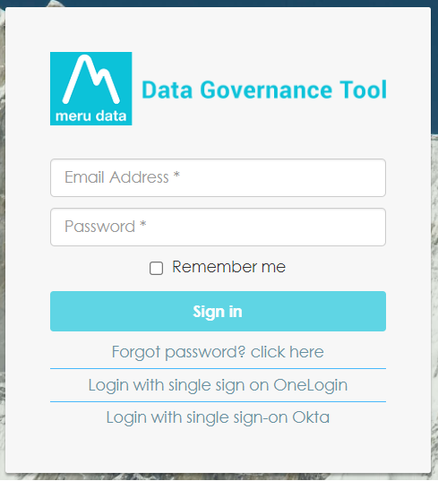
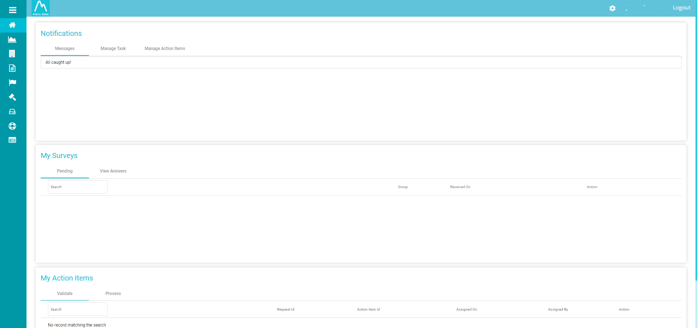
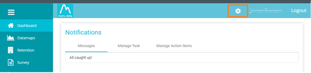

  

[Back](Admin_Guides.md)

# Creating A New User

### *This article will demonstrate how you can Create New Users within Data Governance Tool and how you edit existing users.* 
&nbsp;
1. Enter your Meru Data location on your browser address bar. You will be directed to the Meru Data Governance Tool login page 

  

    
  

2. Fill in your login details - your email ID and password 

  

    
  

3. Once you have filled in your details and successfully logged in, you will be viewing the Data Governance Tool Main Screen

  

    
  

4. On the top right corner of the Main Screen there will be a ‘Settings’ icon  

  

    
  

5. On clicking the ‘Settings’ icon, a drop-down table will appear  

6. From the drop-down table, select the third option; System Users  

  

    
  

7. The System Users page will display a list of all existing users, including their details; their Email Address, Mobile Number, User Group, Status, the option to edit and the option to delete.

  

    
  

8. On the top right of the screen, above the delete option, there is an ‘+Add’ button  

  

    
  

9. Upon clicking the ‘+Add’ button a Pop-up will appear, asking you to fill in the New User details, this will include, First Name, Last Name, Mobile, and 2 email addresses.  

  

    
  

10. You will then have to select a User Group and a User Type  

  

    
  

>**Note:** If you don’t have any existing User Groups to add the new User to, you will not be able to create a new User. To learn more about how to create a new User Group, see [**How to Assign New Roles/Permissions**](Assigning_New_Roles_Permissions.md)

11. User Types include, OneLogin, Okta, NormalUser and ExternalUser

  

    
  

12. Once all the details have been filled in, enable the Multifactor Authentication or MFA, if required.  

> **Note:** MFA remains disabled by default 

13. Click ‘Save’ to save the details and create a New User 

  

    
  

