

  

[Back](Admin_Guides.md)

# How to Configure DSAR

Privacy regulations provide the right for individuals to make Data Subject Access Requests (DSAR) to an organization to access, correct or delete their personal data being processed by the organization. Automation of response to DSARs improves efficiency and enables timely responses to all requests. Data Governance tool quickly and efficiently creates and automates workflows within your organization for processing DSARs. Explained below are the steps to configure your DSAR requests.  

&nbsp;

- Log in to the Data Governance Tool  

    

      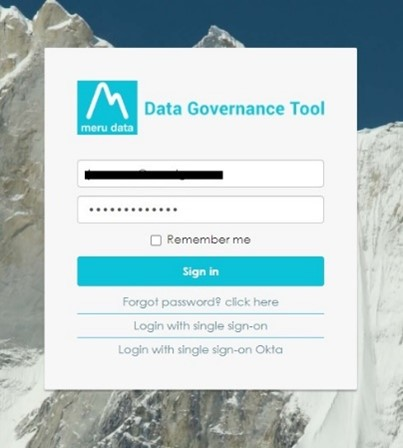
    

- Once logged in, the Main Screen of Data Governance tool will be displayed 

- Click on the ‘**Settings**’ icon on the top right corner of the Main Screen 

    

      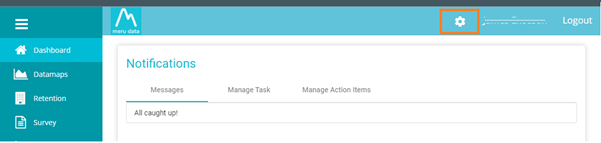
    

- On clicking the ‘**Settings**’ icon, a drop-down menu will be displayed 

- Select the option, ‘**DSAR Configuration**’, from the drop-down menu 

    

      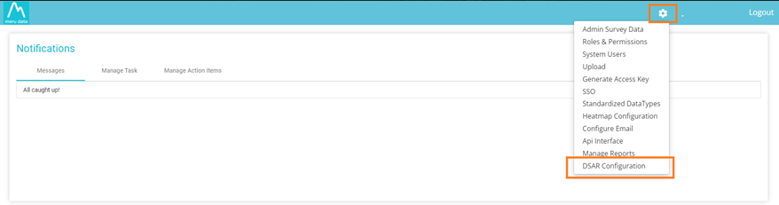
    

- The DSAR Configuration page allows you to integrate the email templates into the Event groups, This page has two main options :-

    - **Events**

    - **Request Flow** 

    

      
    

&nbsp;

> ## Events

- Events are categorized into different event groups :-  

    a. Acknowledge

    b. Submission

    c. Validation

    d. Process

    e. Close

- Select the Event Group of your choice  

    

      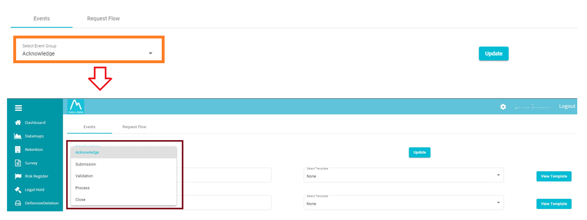
    

    
    
- Based on the selected Event Group, the Event name field will be populated, you can select the required email template from the "**Select Template**" field 

    >Note: To learn more about Configuring Email Templates in detail,see [**How to Configure Email Templates**](Email_Templates_Configuration.md)

    

        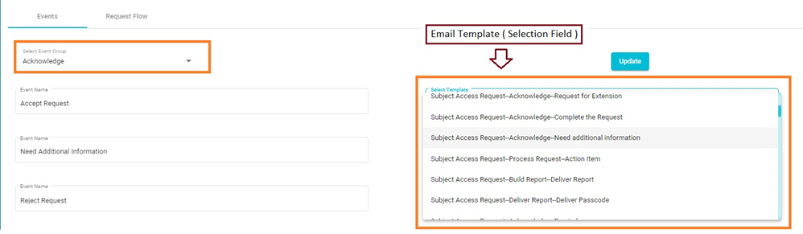
    

- Click on the ‘**View Template**’ button to the right of the ‘Select Template’ field, to go to the ‘**Configure Email**’ page where you can view the email template and make any necessary changes to it.  

   

        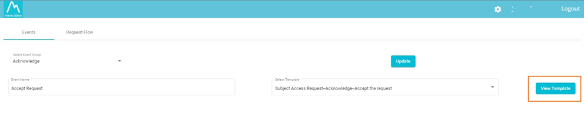
    

   

        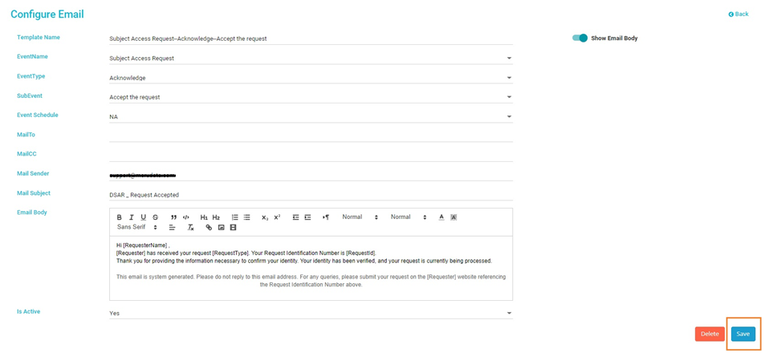
    

- Click the "**Save**" button to save the changes made to the template. 

> **Note: Follow the same steps to configure all event groups.**

 
 

> ## Request Flow

- Request flow is categorized into different ‘**Request Types**’, which can be selected in the ‘**Select Request Type**’ field

   

        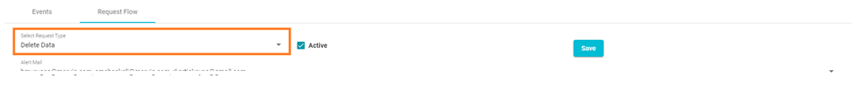
    

- **The different ‘Request Types’ are**

    - Delete Data 
    - Correct Data 
    - Transfer Data 
    - Summary of Data 
    - Copy of Data
    - Unsubscribe
 
 
   

        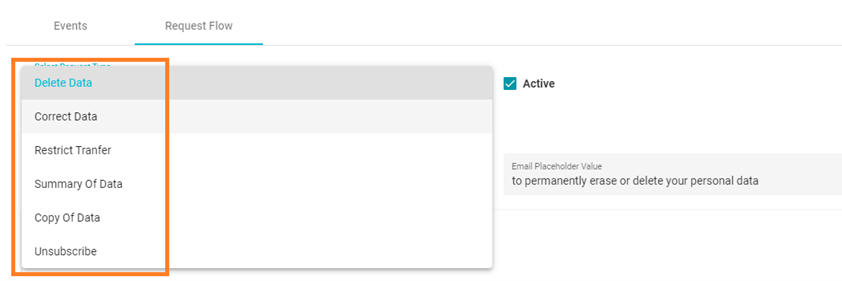
    

- **Request Types are further divided into phases**

    - Verification 
    - Unverified or New 
    - In Validation
    - Need Additional Information
    - In Process 
    - Complete
 
 

- These phases help you to automate the request flow for a specific request type

   

        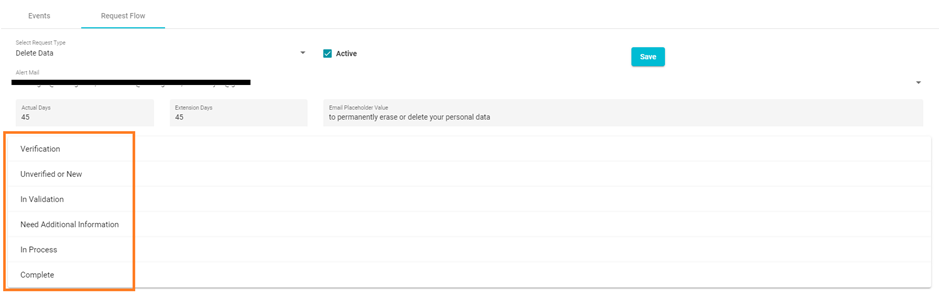
    

- Select the required request type

- Check the Active box to the right of the ‘**Select Request Type**’ field

    

        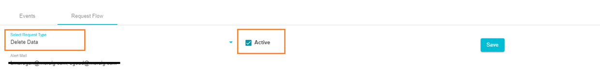
    

> Note: A request flow can only be activated if the active check box is "**checked**"

- **Alert Mail:** This field is where you can set an Alert Mail for the processing time of any request type. That is, the number of days you / your team requires to process a request, and the number of extension days. Here you can also include a placeholder value, which is any information pertinent to the request. This also serves to easily identify the email and the request.

    - The Alert Mail tag will provide you with the list of users' email addresses and select the users who need to be alerted as per your company’s requirements.

    

        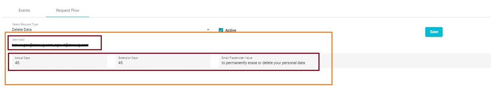
    

 
 

> ### Verification

In this phase, you can set an automation for email verification. This phase will help you schedule how the system sends an email verification request once a requestor submits a new DSAR request.

- Select the required email template you have created using the "**Configure Email**" option for the selected specific request type.

    > Note: Email Verification is standard for all types of requests. You can create only one email template for email verification.The same can be utilized for all event types in the request flow setup.

    

        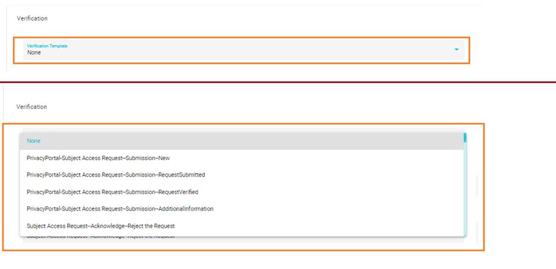
    

- **Verify Email Reminder:** Here, you will need to specify in how many days a reminder email must be sent to the requestor’s email address from the date of the initial email.

- **Reminder in days:** Here you will need to specify in how many days reminder emails need to be sent.

- **Reminder Frequency:** Here you will need to specify the frequency with which the emails need to be sent in the number days that you have specified.
    E.g., If the Reminder in days is set to 5, and the Reminder frequency is set to 2, then 2 email reminders will be sent out in the 15 days.

    > **Note:** Content of a ‘Reminder Email’ will be the same as the Verification Email with '**Reminder:**' added to the subject.

    

        
    

- **Close Request If Not Verified:** In this field, you will need to select the ‘**Close Request**’ template you have created using the **"Configure Email"** option and specify the number of days in which the request needs to be closed if the email is not verified within the specified time frame.

    > **Note:** The number of days is calculated from the initial request date should the request need to be closed.

    

        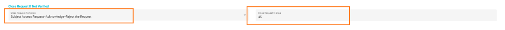
    

-	Once the verification field has been filled, click ‘**Next**’

    

        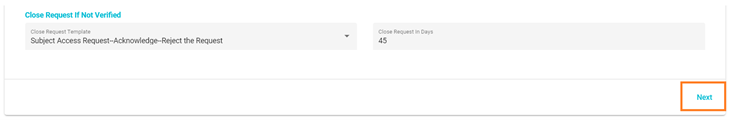
    

 
 

> ### Unverified or New

In this phase you determine whether an Unverified / New request needs to be moved to the ‘Validation Phase’ or to automatically send an email to the requestor to provide additional information if any of the required fields are not filled out in the web request form.

-	**Move to Validation:** This option will automatically push an Unverified / New request into the Validation Phase.

    

        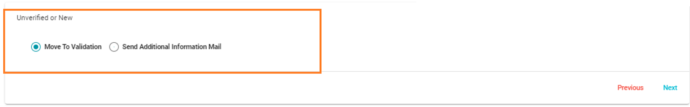
    

-	**Send Additional Information Mail:** This option will check the request submitted by the requestor and automatically send an additional information email with a link. This process will start if they have not specified any specific/important information that your company requires (the required field must be preselected to enable the requestor to identify what information is missing)

    

        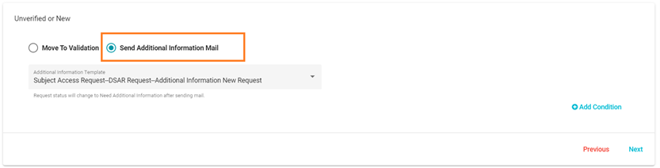
    

-	You will need to select the required email template you have created using the "Configure Email" option for the selected request type.

    

        
    

- Click on '**Add Condition**' to add on what condition the addition information email has to be send.

- An Option will appear to add the conditon with Field, Criteria & value
    - Field: This is where you will select the filed for wich you would like to run your condition
    - Criteria: It can be "Exisit" or "Contains" or "Equals"
    - Value: 

-	The Field value, which is the information required by the company that hasn’t been provided by needs to be selected from the dropdown list. This can be any information like First Name, ZIP code, Customer Number, etc. **( correction Required)**

-	The "Send Additional Information Mail "will then be sent if the selected field is not filled from the requestor end.

-	Once all the required information has been filled, click ‘Next’ 

 
 

> ### In Validation

This phase is where you set up the Strategies on how and who should validate the requests. You can create multiple action items for the requests.

-	Under "Create Strategy", you will need to select either ‘All At Once’ or ‘One By One’. This option will help the system assign the action items all at once or one by one to the users you have specified.

-	Next, under "Match Found Type ", select either "All" or "Any". 
    - In this phase, if you select "All ", all the action items must be completed, only then will the system push the requestor's request to the ‘In-process’ state.
    - Selecting the "Any" option will mean that if any of the action items are completed, the requestor's request will be pushed to the ‘In-process’ state.

    

        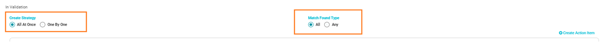
    

-	Click on ‘**Create Action Item**’ and the fields to create a new Action Item will open

    

        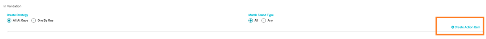
    

-	To assign the Action Item to users, select their email IDs from the drop-down list under ‘Email to’

    > **Note:** Multiple email IDs can be selected.

    

        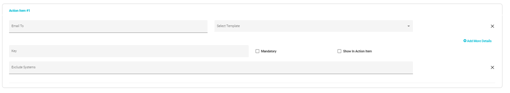
    

    
    

        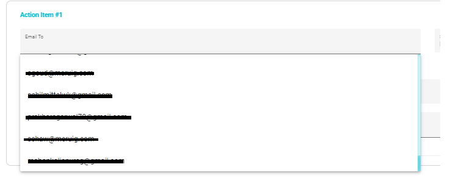
    

-	Select the Action item email template you have created (Using the "Configure Email" option). When a request is moved to In Validation, the user that you have assigned the Action Item to, will receive an email with a link that will take the user directly to said Action Item.
    
    

        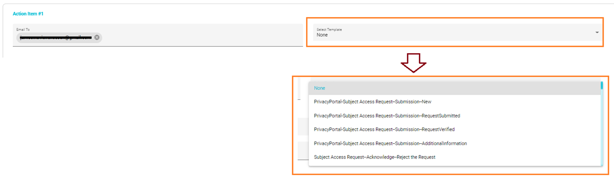
    

-	The next field is "Key". You can specify any information about the Action Item to easily identify the requester details. For example, if the information you have about your customer is a unique value called customer ID, and you can specify the "Key" as Customer ID. Then the user to whom you assign this action item can enter the same in the required field and complete the action item.

-	There are 2 other options are integrated with this, Mandatory and Show in Action Item

    - **Mandatory:** You can Make the Key field mandatory without specifying the required info on that field; the user can not complete the request.

    - **Show in Action Item:** This option will make sure whatever the information provided by the user who has completed the action item in the In Validation state, that information will be shown once the request is moved to the "In Process" state.
    
    

        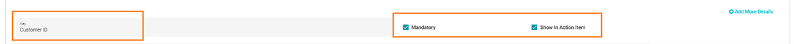
    

-	Exclude Systems, this is where you can select any specific system which you want the user to avoid while validating the action item.
    
    

        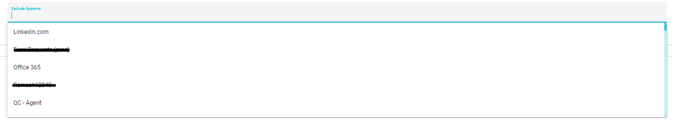
    

-	You can further add more details by clicking on ‘**Add more details**’

    

        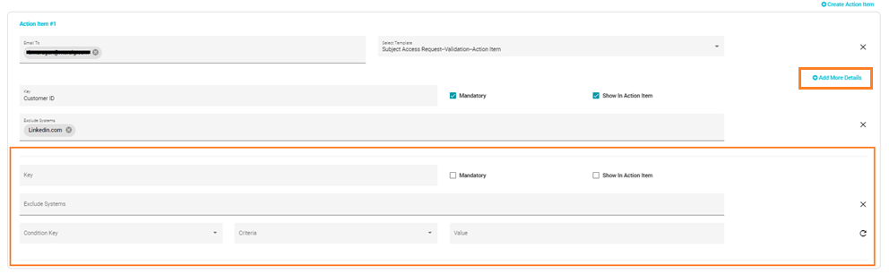
    

-	You can also create multiple Action Items by clicking ‘**Create Action Item**’

-	**Identity Action Mail Reminder:** Once all the action item details have been specified, you will have to specify the number of days in which a ‘**Reminder email**’ will need to be sent and its Frequency
    
    

        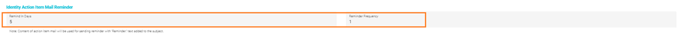
    

-	**On Match Found:** This option is where you assign a specific email template. Once the user completes the request with '**Match found**', an ‘**Accept Request**’ email will be sent to the requestor (an email template must be selected for this action which you have created (Using the "Configure Email" option)). 

- **On Match Not Found:** If the user selects the '**Match not found**' for the action item, a request to provide additional information will be automatically sent (an email template must be selected for this action which you have created using the "**Configure Email**" option).
    
    

        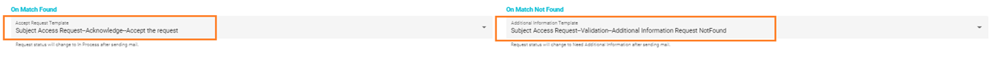
    

-	Once the In-Validation field is filled, click ‘**Next**’ 

 
 

> ### Need Additional Information

This phase is where the "**Additional Information Mail Reminder**" and "**Close Request If Not Responded**" fields are set up.

-	**Additional Information Mail Reminder:** Here you will specify the number of days in which the ‘**Need Additional Information**’ Reminder Email must be sent. The number of days will be counted from the date of the initial email. The Frequency of the emails will also be specified here

    > Note: Content of additional information mail will be used for sending a reminder with 'Reminder:' text added to the subject.

    

        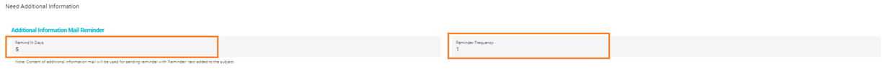
    

-	**Close Request If Not Responded:** In this field, you will need to select the Close request template you have created using the "**Configure Email**" option and specify the number of days in which the request needs to be closed if additional information is not provided within the specified time frame.

    

        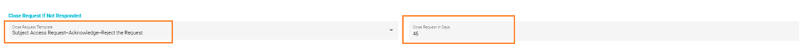
    

-	Once the Need Additional Information Field is filled, click ‘Next’

 
 

> ### In Process

This phase lets you set up the System Action Items to requests in the “**In Process**” state based on the request types. You can create a custom action item as well.

-	When you select the In Process phase, the pre-created system based action items will automatically get populated

> **Note:** If you have created a new system action item and want to update the request flow (In Process), You can directly go to ‘**In Process**’ and click on ‘Update Action Items’ and the new system-based action item will be added.

-	You can also create a custom action item as well (Not mandatory); check the “Custom Action Item” box, then the option will appear.

    

        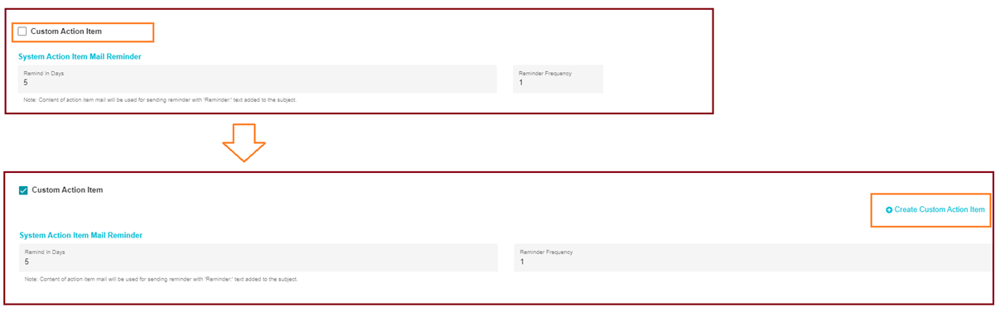
    

-	Edit the Name as per your requirement and select a key. Then you will need to select an email template you have created using the "**Configure Email**" option.
   
    

        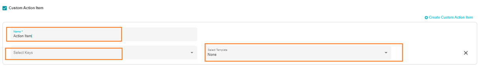
    

-	Lastly, you will need to specify the number of days to send the "**System Action Item**" reminder email. That is, in how many days an email reminder must be sent to the user's email address, to whom the action item has been assigned. The number of days is counted from the date of the initial email. The email reminder frequency will also need to be set.
   
    

        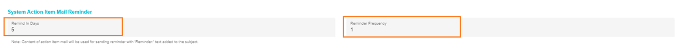
    

-	Once the "**In Process**" fields are filled, click "**Save**"
   
    

        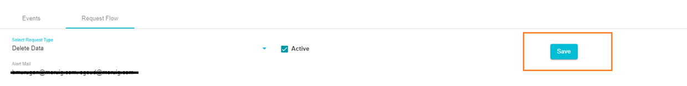
    

> ### Complete

This phase lets you select the email template required for the Email acknowledge message for once the request is completed.

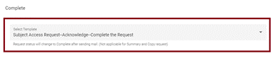

> **Note: Follow the same steps to configure all Request Types.**