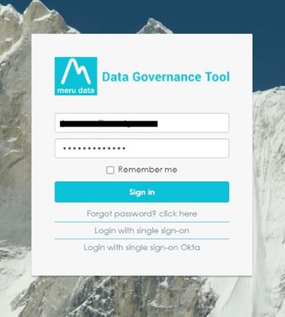
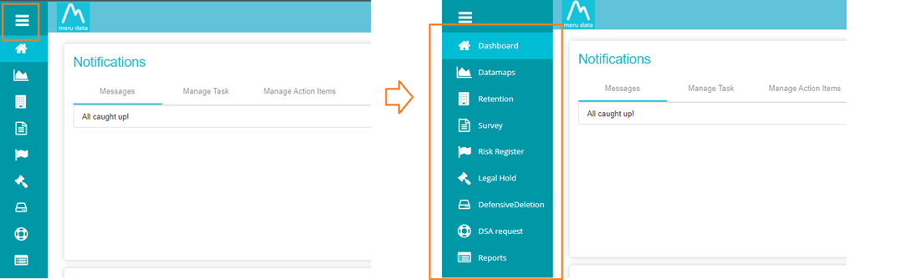
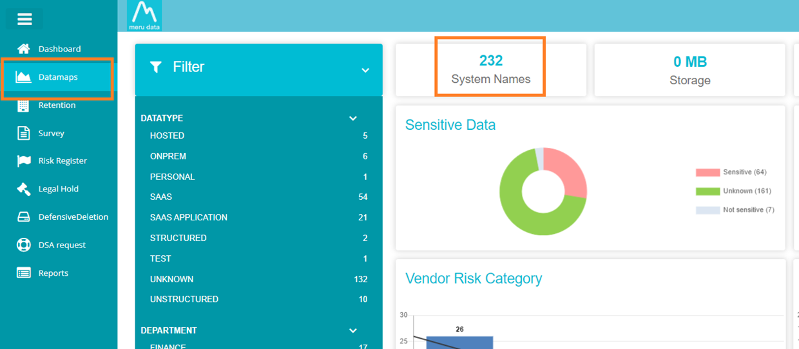
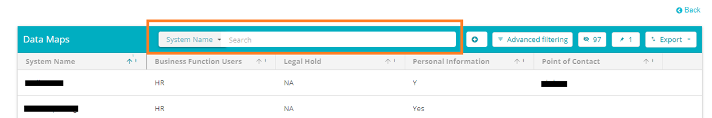
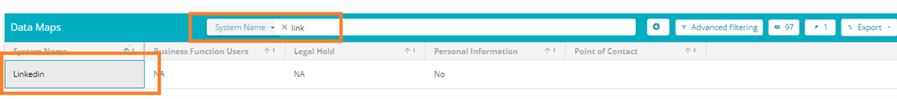
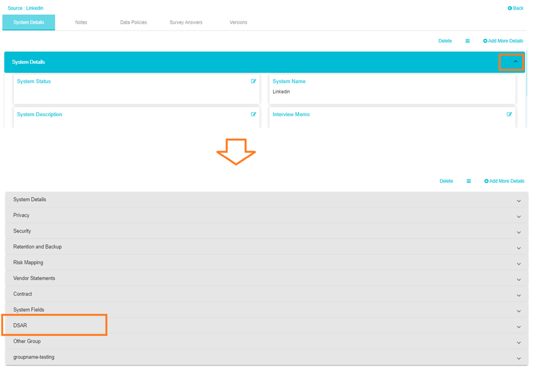
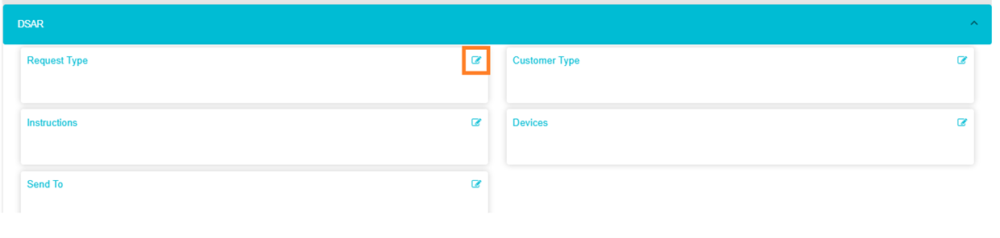
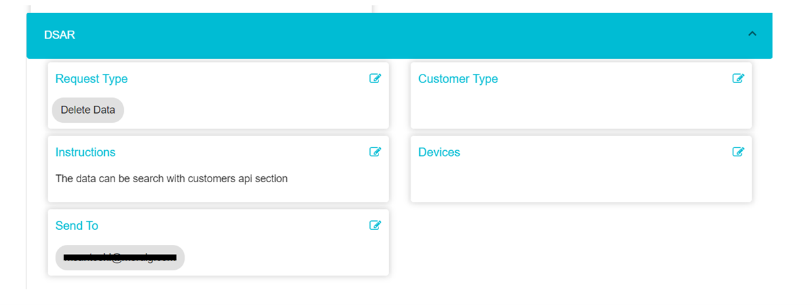
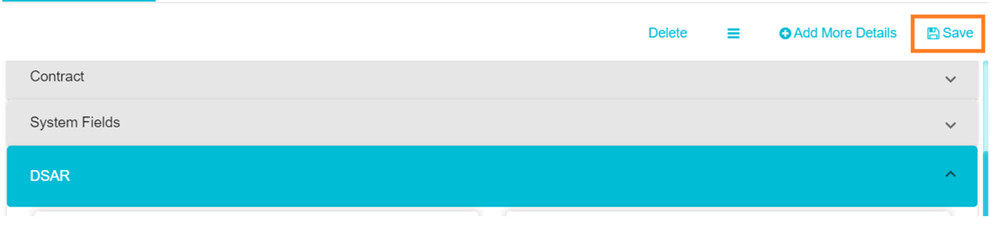

  

[Back](Admin_Guides.md)

# How to Configure DSAR System Action Item

A System Action Item is an action item specific to a particular System. Since different systems have different and varied protocols and processes, defining a system action item means tailoring the instructions and processes to fit that particular system.  

&nbsp;

1.	Log in to the Data Governance Tool

    

      
    

2.	Once logged in, the Main Screen of Data Governance tool will be displayed

3.	From the Data Governance Tool Main Screen, click on Menu , on the top left of your screen.

    

      
    

4.	Under Menu, select the second option – DataMaps

5.	On the DataMaps Screen, click on System Names to view the table of System Names and their fields

    

      
    

6.	In the search tab of the System Names screen, search for the System to which you would like to add a new System Action Item

    

      
    

    
    

      
    

7.	Click on the System Name

8.	A page will be opened with multiple fields. Collapse all the fields and select DSAR

    

      
    

9.	Click on the Edit Icon  to edit the fields under DSAR

    

      
    

10.	Select the request type to which you wanted to assign this system action item; you can select multiple request types for the same system.

    

      
    

11.	Fill all the necessary fields as per your requirement and select the user email address in the ‘Send To field’

12.	Once the System is added to the specific Request type as an action item, click ‘Save’

    

      
    

