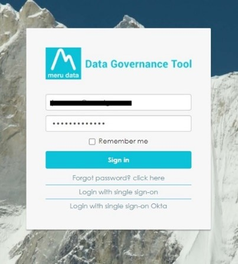
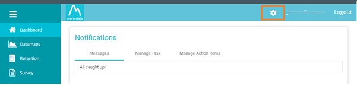
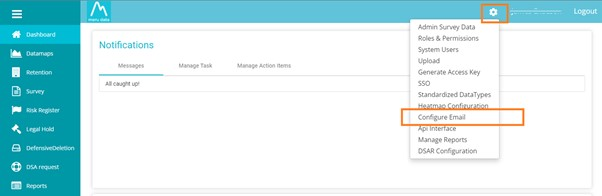
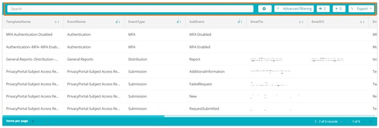
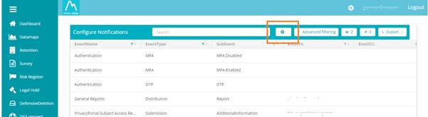
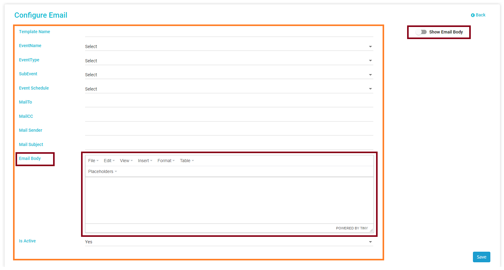
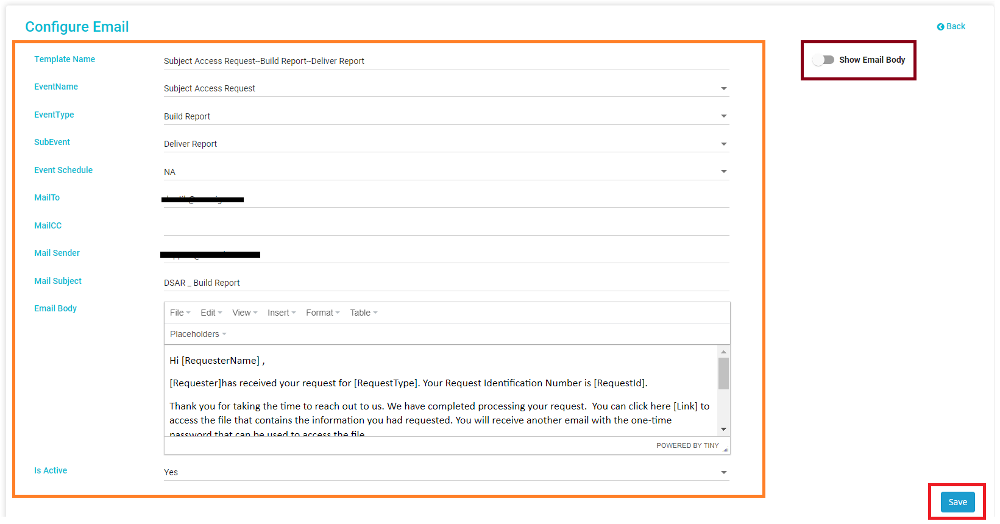

  

[Back](Admin_Guides.md)

# How to Configure Email Templates

### *DSAR requests are enabled by the exchange of emails between yourself and your clients. It is through emails that clients can send in their requests, ask for information, verify information etc. It also via emails that you verify requests, validate requests, keep clients informed and such. Data Governance Tool not only enables you to configure emails for every possible Event Type, it also provides the ability to schedule automated reminder emails as per your requirements and utilize already drafted templates.*
&nbsp;

1. Log in to the Data Governance Tool  

    

    
    

2. Once logged in, the Main Screen of Data Governance tool will be displayed 

3. Click on the ‘Settings’ icon on the top right corner of the Main Screen 

    

    
    

4. On clicking the ‘Settings’ icon, a drop-down menu will be displayed 

5. Select the option, ‘Configure Email’, from the drop-down menu 

    

    
    

6. The Email Configuration Page will display already existing email templates, as well as the option to search, create new templates, filter templates and export.  

    

    
    

7. To create a new template, click on the add button located to the right of the ‘Search Bar’  

    

    
    

8. The Email configuration page will display multiple fields :

    

    
    

&nbsp;

## Email Template Field Description

  |  Title 	| Description  	|
  | :---:	| ---	|
  | Template Name   	| You can title the email template when creating/editing  	|
  | EventName   	| Refers to the type of event or activity this email template will be integrated to, e.g., Authentication / Subject Access Request (DSAR) / Survey, etc.  	|
  |  EventType 	|  This is the subcategory of "Event Name". Based on the event name you have selected the event type will need to be selected from the predefined dropdown. For example, if you have selected as "Subject Access Request" under EventName, then the EventType dropdown will show Acknowledge / Agent / Build Report / Closed, etc. 	|
  |  SubEvent 	| This is the subcategory of "EventType" based on the event type you have selected the subevent will need to be selected from the predefined dropdown. For example, if you have selected the event name as "Subject Access Request" and the Event type as "Acknowledge" then the subevent dropdown will show Accept the request / Close Request / Complete the request, etc.  	|
  | Event Schedule  	| Here you can schedule the frequency with which the email will go out, i.e., Daily / Hourly / Monthly / NA (No Action: this option is for keeping the event schedule blank/invalid) / Weekly, etc  	|
  |  MailTo 	| This field is used to assign single or multiple email addresses of any specific person/user.  If this template is selected for any workflow, they will receive the email, or you can leave it blank  	|
  | MailCC   	| This field is used to assign single or multiple email addresses of any specific person/user. If this template is selected for any workflow, they will be marked in the CC, or you can leave it blank  	|
  |  Mail Sender 	| This field is where the sender’s email address is mentioned  	|
  | Mail Subject  	| This field is to define the Email subject  	|
  |  Email Body 	| This field is where you will be able to define the content of your email. This can be mentioned either in text or HTML code  	|
  |  Is Active 	| This option will define whether the configured email template is active or not. E.g., if it is set to Yes, then the template will be Active, if it is set to No, then the template will be Inactive  	|

&nbsp;

> **Note : All the below fields are enabled only for a few EventName / EventType / SubEvent**

&nbsp;

  |  Title 	| Description  	|
  | :---:	| ---	|
  |     Report 	| This field lists all the various Reports,Based on the requirement you can select one or more (Check Boxes) reports to add to your template |
  | Additional Information | This field provides Multiple additional Information choices (Check Box); based on the requirement, you can select one or more to add to your template  	|
  |  Reminder In   	| This field will help you specify or set the reminder frequency (in days). For example, if you mention 2 in the field, then a reminder will be sent within 2 days from the date of the initial email  	|

&nbsp;

> **Note :** To learn more about email configuration fields in detail,see [**Email Template Field details**](Email_Template_Field_details.md)

9.	Once all the required information has been filed in, click the ‘Save’ button at the bottom right of the page. 

    

    
    
