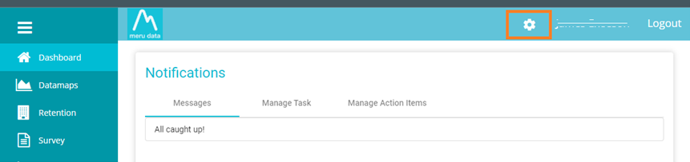
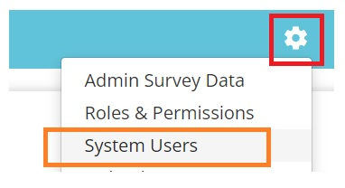
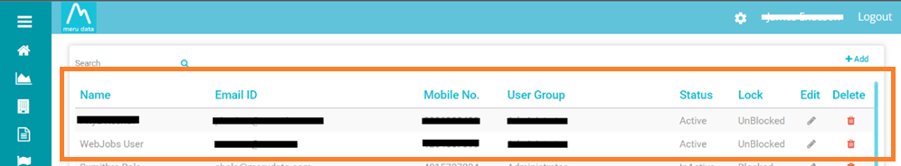
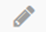
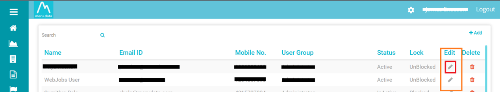
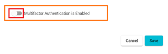
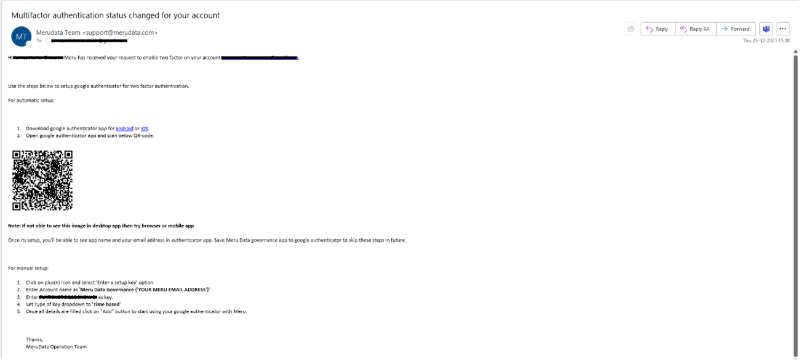

  

[Back](Admin_Guides.md)

## Enabling MFA on Data Governance Tool

### *This article will help you understand how to enable MFA in Data Governance Tool*
&nbsp;
1. Log in to the Data Governance Tool  

    

    
    

2. Once logged in, the Main Screen of Data Governance tool will be displayed 

3. Click on the ‘Settings’ icon on the top right corner of the Main Screen 

    

    
    

4. On clicking the ‘Settings’ icon, a drop-down menu will be displayed 

5. Select the third option, ‘System Users’, from the drop-down menu 

    

    
    

6. The System Users page will display a list of all existing users, including their details; their Email Address, Mobile Number, User Group, Status, the option to edit and the option to delete 

    > **Note:** To learn more about how to create a new user, see [Creating A New User](Create_New_User.md)

    

    
    

7. To enable MFA for an existing user:

    - Find the user from the list 

    - Click on the ‘Edit’ Button , which is present on the right end of the Users row

        

        
        

    - An ‘Edit User’ pop-up window will appear with the option to edit the Users information, such as their name, number, etc. 

        

        
        

    - Scroll down to the bottom of the window to see ‘**Multi-factor Authentication is Disabled**’  

        

        
        

    - Enable the option, which will change the sentence to ‘**Mutli-factor Authentication is enabled**’

    - Click ‘Save’

        

        
        

    - The User will get an email with all the information to set up Multi-factor Authentication

        

        
        

> **Note :** To learn more about How to Activate your MFA ,see [**MFA**](Admin_Guides.md)
