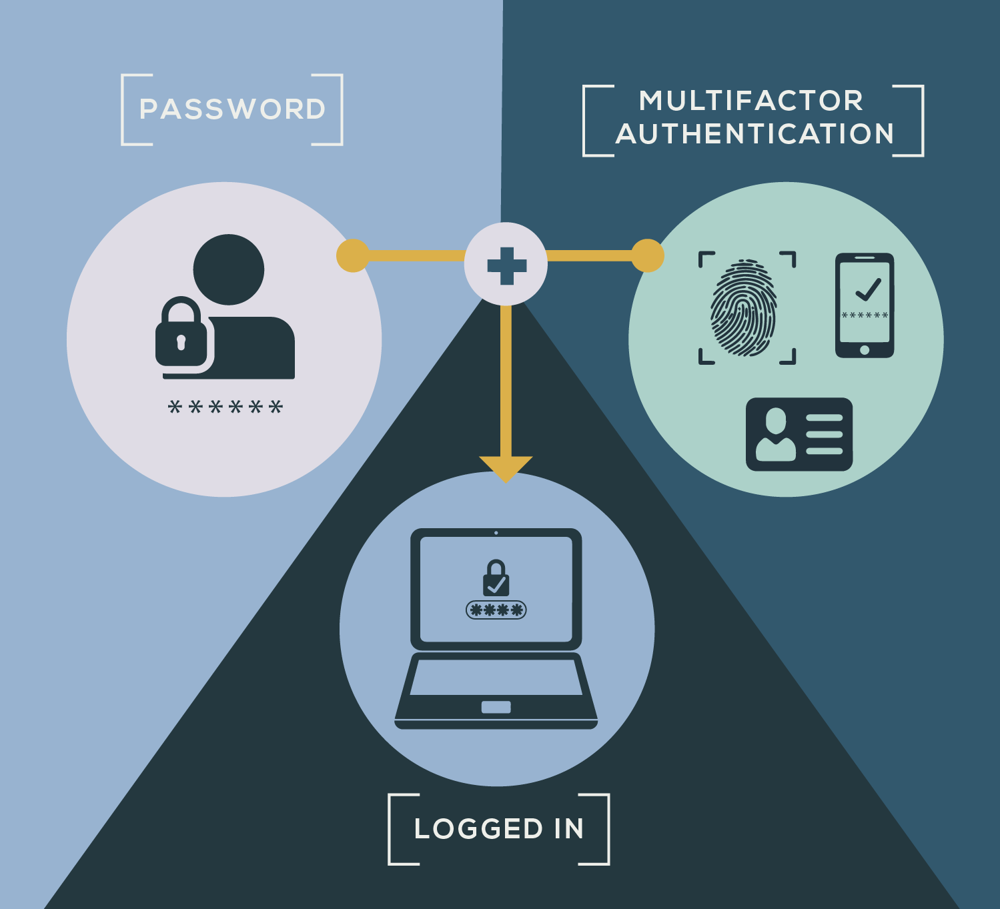

  

[Back](User_Guides.md)

# Multi-factor Authentication 

### *This article will help you understand what Multi-factor Authentication is, why it’s important and information on how to use Google authenticator with Data Governance Tool.*

Multi-factor Authentication is a method that, in addition to the regular sign-in process involving a username and password, requires the user to provide two or more verification factors such as entering a code from your phone or providing biometric information like a fingerprint scan. Single-factor authentication, (example using only passwords), is a weak form of security and leaves room for attacks by third parties. Multi-factor Authentication on the other hand, requiring additional verification, strengthens security and privacy

  

> ***Note:*** The Data Governance Tool admin can configure MFA at the user level. Once enabled, end users are prompted to confirm their credentials with factors when signing in to Data Governance Tool.

> To learn more about How to enable MFA, see [**Enabling MFA**](Enabling_MFA.md)

### Supported MFA Authenticator

- **Google Authenticator**

    Google Authenticator is an application that supports MFA by utilizing a Time based One-Time Password (TOTP) as the second factor of authentication to sign-in to environments that require Multi-factor Authentication. 

### Setting up Google Authenticator for Data Governance Tool

- Once an admin has enabled the Multi-factor Authentication for the user, the User will receive an email to the registered email address from MeruData Team with the ‘**Steps to set up Google Authenticator App**’  

- This email will also provide a QR code  

- There are 2 ways to set up Google Authenticator with Data Governance Tool:

     **1. QR Code**  
     **2. Manual Set-up**  

## 1. QR Code  

1. Download the Google Authenticator App on your Android or IOS device  

2. Once the App has been downloaded, Open the App and click on the 3 dots on the top right of your screen 

3. Select ‘+ Add Account’ from the drop-down menu that appears  

4. Select which kind of Account you want to add; Personal, Work/School or Other  

5. On selecting the Account of your choice, A pop-up box will appear with 2 options – 1) Scan a QR code, 2) Sign in 

7. Select ‘Scan a QR Code’  

8. Scan the QR code that you have received in your email from MeruData Team  

9. Once the QR code has been scanned, Time based One-Time Password (TOTP) for Data Governance Tool will be enabled on Google Authenticator 

10. After this has been done, any time you wish to sign in to Data Governance Tool, you will have to follow the following steps  
    - Go to the Data Governance Tool site  
    - Enter your user ID or email address and then your password  
    - Click on ‘Sign In’ 
    - A pop-up box will appear asking you to enter a 6 digit code  
    - The 6-digit code to be entered will be provided by the Google Authenticator App on your mobile phone  
    - Open your Google Authenticator app to access the 6 digit code  
    - Type in the code on the Data Governance Tool sign in page and click on ‘Sign In’  
    - You can also select the ‘Don’t ask code for 7 days’ option if you don’t wish to keep feeding in a newly generated code every time you sign in. However, this option lasts only for 7 days. 

## 2. Manual Set-Up 

1. Download the Google Authenticator App on your Android or IOS device  

2. Once the App has been downloaded, Open the App and click on the 3 dots on the top right of your screen 

3. Select ‘+ Add Account’ from the drop-down menu that appears  

4. Select which kind of Account you want to add; Personal, Work/School or Other  

6. On selecting the Account of your choice, A pop-up box will appear with 2 options – 1) Scan a QR code, 2) Sign in 

7. Select ‘Sign In’ 

8. The account name that you enter should be the email address that you use to sign in to the Data Governance Tool 

9. A mail containing a pass key will be sent to you registered email address 

10. Enter this pass key on the Google Authenticator app  

11. Set ‘Time-based’ as the type of key 

12. Once all the details have been filled in, click on ‘Add’ to start using Google Authenticator with Data Governance Tool 

13. After this has been done, any time you wish to sign-in to Data Governance Tool, you will have to follow the following steps  
    - Go to the Data Governance Tool site  
    - Enter your user ID or email address and then your password  
    - Click on ‘Sign In’ 
    - A pop-up box will appear asking you to enter a 6 digit code  
    - The 6-digit code to be entered will be provided by the Google Authenticator App on your mobile phone  
    - Open your Google Authenticator app to access the 6 digit code  
    - Type in the code on the Data Governance Tool sign in page and click on ‘Sign In’  
    - You can also select the ‘Don’t ask code for 7 days’ option if you don’t wish to keep feeding in a newly generated code every time you sign in. However, this option lasts only for 7 days. 

 

