

  

[Back](Admin_Guides.md)

# Manage Reports User Guide

The Manage Reports application enables easy management of reports generated for distribution of Surveys within the Data Governance Tool.

The Manage Reports option can be accessed from the Settings menu on the Data Governance Tool.

  

    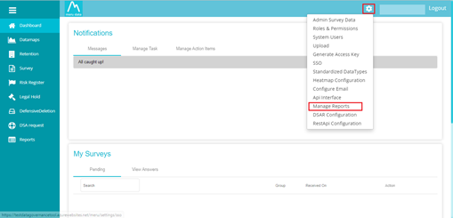
  

## Types of Reports

**1. Pre-defined Reports:**
    Pre-defined set of reports can be generated for data governance and retention reports.

  

    
  

> **Note:** There is an option to Enable Notes for pre-defined notes.

**2. User-defined Reports:**
    User-defined reports are generated only for survey distribution reports.

  

    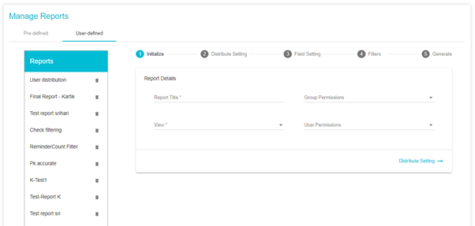
  

 
## Generating a Report

**1. Initialize**

This pane provides fields for making basic selections for the report, including the title, permissions, index, etc.

**The available fields for pre-defined reports are:**

- **Report Title:** Choose a name for the report you are about to generate

- **Index:** The index is the category the report is to be generated from. This can be **Datagovernance** or **Retention** in case of pre-defined reports and **Survey Distribution Report** in case of user-defined reports.

- **Columns:** Select the columns that should appear in the report

- **Group Permissions:** Add the groups from the list that should be given permission to view the report

- **User Permissions:** Add the individual users who should be given permission to view the report

- **Enable Notes:** By enabling notes, a new column for notes will appear when the report is generated

- **Chart-Report:** By checking this box, the report will be generated in the form of a chart. The filter option will not be available if the report is generated as a chart.
 
  

    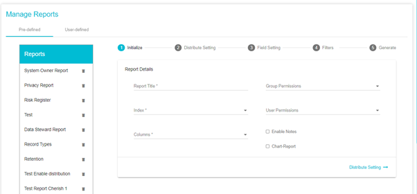
  

**The available fields for user-defined reports are:**

- **Report Title:** Choose a name for the report you are about to generate

- **View:** The view is the category the report is to be generated from.

- **Group Permissions:** Add the groups from the list to give permissions for the report. (The permissions can be managed by the Admin).

- **User Permissions:** Add the individual users to give permissions for the report. (The permissions can be managed by the Admin).

- **Survey Names:** The list of available surveys from where the data can be taken

- **Columns:** Select the columns that should appear in the report
 
  

    
  

Click **Distribute Setting** option at bottom right corner to go to the next section.

**2. Distribute Setting**

This pane provides options for distributing the report through email.

1. Check the box next to Enable Distribution to distribute the report via email
2. Select the users from the Users list for sharing the report
3. Select the appropriate template: Templates with Hourly or Monthly frequencies are available. The frequency should be chosen based on the number of times the report has to be distributed via email.

> **Note:** Additional templates can be created by the Admin.
 
  

    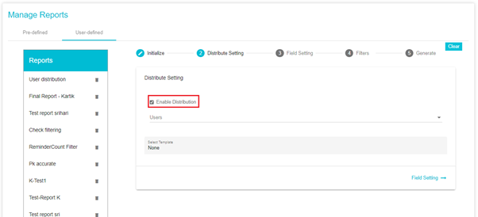
  

Click **Field Setting** option on bottom right corner to go to the next section.

**3. Field Setting**

This section allows sorting of the rows and columns in the report.

**Column Sorting** provides the option to choose the order (ascending or descending) of a particular column in the report.

1.	Click on the “+” symbol
 
  

    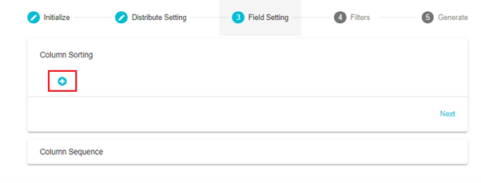
  

2.	Choose the Column from the Column drop down
3.	Choose the Order of sorting
 
  

    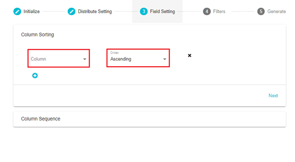
  

 
- Add additional columns by clicking the “+” symbol
- Delete any column by clicking the “X” symbol beside that particular column
 
  

    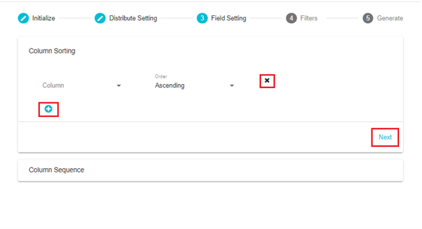
  

Click **Next** to go to Column Sequence.

- **Column Sequence** provides the option to sort the columns in the report.
- Here, you can see the columns that are visible in the report and choose to hide any columns.
- Hide a column by clicking and dragging it to the Hidden Columns side.
 
  

    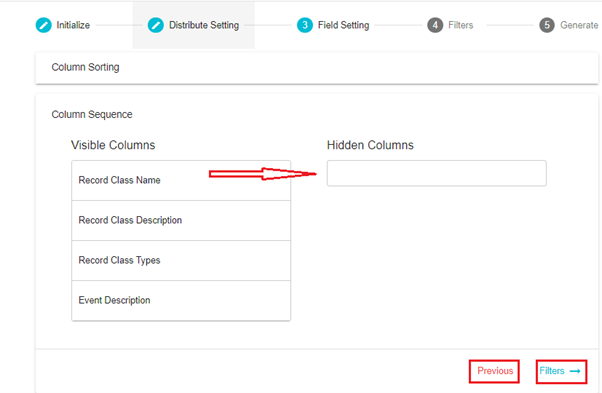
  

 
Click Previous to go back to Column Sorting.

Click **Filters** to go to the next section.

4. **Filters**

This section allows to add condition(s) for filtering the reports.

1.	Choose from the “AND” or “OR” ruleset
2.	Select the rule type from the drop down
 
  

    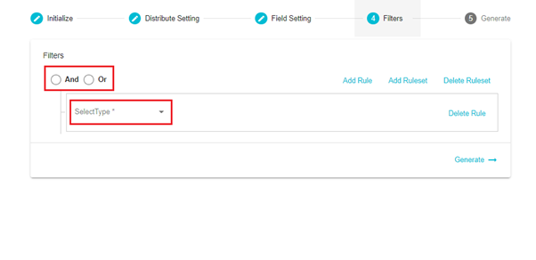
  

 
3.	Choose criteria for the rule type from the drop down
 
  

    
  

 
4.	Add a value for the criteria
5.	Click Generate
 
  

    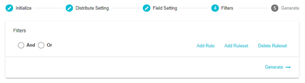
  

**Add Rule:** The Add Rule option can be used to add a new rule for filtering
 
  

    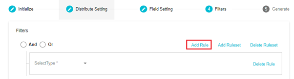
  

**Add Ruleset:** This option can be used to create a new ruleset 
 
  

    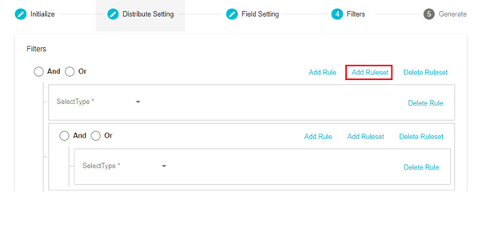
  

 
**Delete Ruleset:** This option can be used to delete an existing ruleset

**Delete Rule:** This option can be used to delete a rule
 
  

    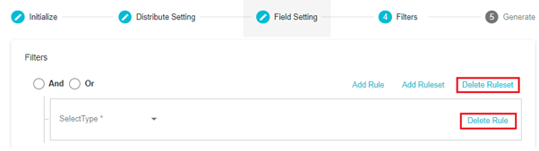
  

5. **Generate**

Here, you will see a summary of the report being generated based on the selections that have been made.

After confirming the summary, click Generate Report to go ahead with generating the report.
 
  

    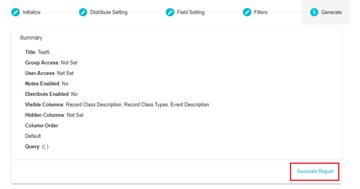
  

> **Tip:** You may go back to any the four sections to make changes to the selections made. Just click the section name to go directly to the settings for the same.

