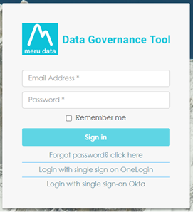

  

[Back](User_Guides.md)

# Password Reset

> ### *Are you having trouble accessing your account or resetting your password? Learn more about signing in to your Meru account and how to troubleshoot account access issues.*
&nbsp;

1. Go to the Data Governance Tool site 

2. On the Data Governance Tool site, you will be asked to fill in your User ID and password to sign in

  

3. Click on the option below the ‘**Sign in**’ button that reads ‘**Forgot Password, click here**’ 

  

4. A new page will open to enter your registered email address

5. Type in your registered email address and click ‘**Send Mail**’, this will send a link to reset your password to your email

  

6. Once the link has been sent to your email, a message will appear on your screen that reads, ‘**Successfully sent reset link to your email**’

  

7. Open your email to find the mail from MeruData Team

8. The email from MeruData Team will read ‘**Please click here to reset your account password**’

9.	Click on the blue word ‘here’ in the above sentence as it is a link that will redirect you to a new page 
 

  

10.	On the new page, you will be asked to type in your new password twice to confirm it. 

> **Note:** Make sure that it meets the requirements; 14 characters, a lowercase character, an uppercase character, a number and a special character

11.	Once you have successfully typed in your new password and confirmed it, click on ‘Reset’ 

  

12.	Your new password has been successfully created 

  

13.	You can now log in with your new password

&nbsp;
&nbsp;