

  

[Back](Admin_Guides.md)

# How to process a Data Subject Access Request (DSAR) - Admin Guide

Privacy regulations provide the right for individuals to make Data Subject Access Requests (DSAR) to an organization to access, correct or delete their personal data being processed by the organization. Automation of response to DSARs improves efficiency and enables timely responses to all requests. Data Governance tool quickly and efficiently creates and automates workflows within your organization for processing DSARs. On Data Governance Tool, manually managing the workflow for requests by validating and processing them is also made easy and secure. This guide will take you through the process of processing DSA requests as an Admin.

All DSA requests are submitted through the form on the website privacy portal or the IVR (toll-free number).

Under CCPA, California residents can make the following requests: Summarized Categories of Information, Copy of Information, Opt-Out, and Delete Data

Nevada residents can make Opt-Out requests 

Data Governance Tool users are generally assigned Action Items by their respective Admins when a DSA request comes in. This guide demonstrates all the steps involved in processing a DSA request from the user's standpoint.

  

    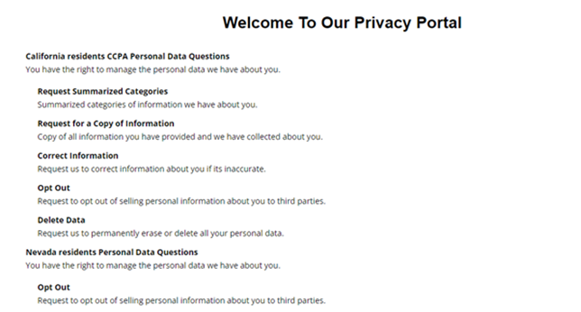
    

-	Once the requestor submits the Request, an email will be sent asking them to verify the primary email address provided in the form. 
-	At the same time, an email will be sent to the requestor to verify the primary email address provided in the request submission form

> **Note:** The request is saved temporarily until the web job runs. This happens automatically every hour. The web job will move the request that was temporarily saved to the processing automatically.

- On clicking “Active Requests” on the DSA Request page you will be directed to the page displaying all DSA requests. Here, you’ll get an overview of all the active requests

    

      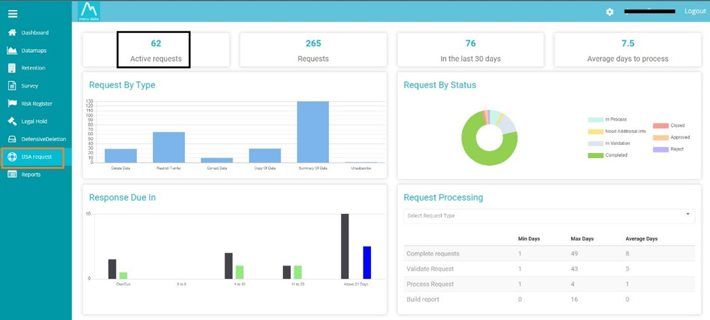
    

    

      
    

## Available features

-	**Search:** You will be able to search for requests by using this option.

    

      
    

-	**Add:**  You can create new requests  

-	**Advanced Filtering option:** You will be able to add Conditional filters by using this  option.

-	**Open Column:** By Click on the Open Column  option, you can see and select the fields, that you want appearing on the grid

-	**Open Column - Pinning Option:** This option will allow you to pin an entire row 

    

      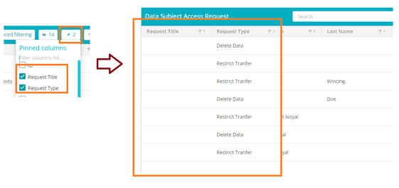
    

-	Export:  You can export the DSAR request table either in the Excel or CSV format
-	Delete: You can directly delete any DSAR Request from the list without having to open them individually by clicking the **Delete**  icon against that request.
 
-	Click on any request to manage the workflow for that particular request.

### A Request is categorized into 5 Phases

  1.	Request
  2.	Validate Request
  3.	Process Request
  4.	Build Report
  5.	Deliver

> ### 1. Request

-	On the left side of the page, you will see all the information the requestor provided during the request submission, including the Request Title, Request Type, Request Date, and the requestor’s details.
-	On the right side of the page, you will see the Request ID, Status, Summary, and Due Date.
-	You will be able to check the log of all the updates made on the request by clicking “History”

    

      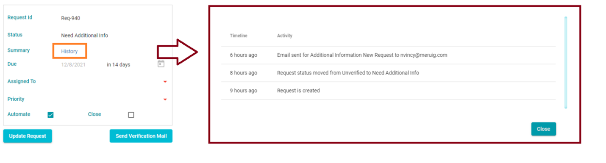
    

-	**Assigned To:** This With this option, you can Assign the Request to any specific user
-	**Priority:** Select the priority level you want the task to be from the drop-down menu by clicking ‘Priority’
 
    

      
    

-	**Automate Option:** This Option will allow you to deactivate the Automate option for the specific request and make it a manual request.
  
    

      
    

-	**Close Option:** This will close the entire request. If you select the close option, a new field will appear below, and you will need to specify the reason for the closure
 
    

      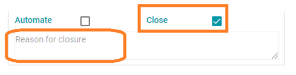
    

 
-	You can send a Verification Mail to the requestor by clicking on 

-	After filling in all the information, click  to save the changes.

> ### 2.	Validate Request

Validation of Request involves matching the requestor’s details against the company database. The request can be processed if the requestor details are found in the database, otherwise, additional information is required. For this, an email will have to be sent to the requestor to provide the additional information.

-	Validate Request consists of 2 parts

      - **Validate:** This page will display the Requestor Identity and the Acknowledge field for the request
      - **Act:** This page will help you to manage and Create New Action Items

          

            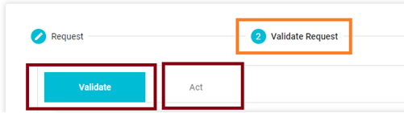
          
 

-	Validating a request can be done in 2 ways - Automation & Manual

    - Automation: It is based on the [DSAR Configuration](DSAR_Configuration.md), which is set from your end (Admin) for all types of requests.

    - Manual: If Manual is selected, the admin must perform all phases manually.

 

#### Validate:

-	The Validate Request Page shows on the left-hand side, **Requestors Identity**. Here you will see all the information the requestor provided during the request submission
-	On the Right-hand side of the page is **Acknowledge**. Here you will see option to send out emails while processing the request manually
    - There are multiple options available, which will help you in with manual request processing
    - You will be able to add to or modify the email address, the email subject and email content.
    - You will be able to preview the email before sending it.

>**Note:** To modify the email linked with the Acknowledgment option, you will need to modify it through the [Configure Email](Processing_a_DSAR_Admin_Guide.md) Option 
 
  

    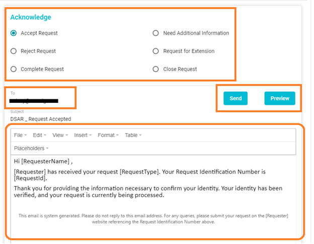
  

  

-	On the bottom of the page (on the left-hand side of the validate page), there is a field **Communications**, this option will help you track all the past communication made for the selected request.

-	The **CCPA requirements** for the request is also displayed on the bottom of the page, above Communications. 
 
  

    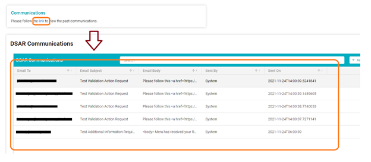
  

 

#### Act

-	Click on the Act option to set or manage the action items for the request
 
  

    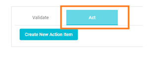
  

 

-	On clicking **Create New Action Item** the system will create a new action item, and you can specify the tasks details of said action item, like the **Key Value**, to whom the action item should be assigned and any other comments or details. You can find the Request details on the left and set the response for said request on the right.

-	You can add multiple Action Items for each request
 
  

    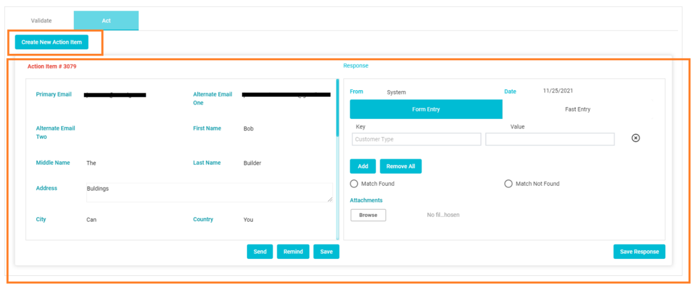
  

 
-	By clicking on the **Send** button, you can select the user to whom the action item should be assigned and send the action item to them.

-	If you are processing the request manually, you can fill in the details required and submit the same. Select “Match Found” or Match Not Found” based on whether or not the requestor’s information has been found in the company database. By clicking on the “Save Response” the same will be saved 

> **Note:**  If you want to know how to process an action item , refer to the [DSAR User Guide](Processing_a_DSAR_User_Guide.md).

-	If you want to immediately move the request to the next phase, reject the request or request for additional information, you can go to Validate option and select the required acknowledgment. After selecting the correct Acknowledgement, click “Send” (Manual Process)
 
  

    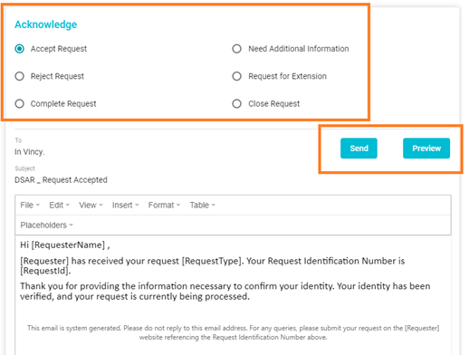
  

Note: if the request is set to “Automate”, the action item which you have submitted or any user has submitted, will move the request to Next Phase. This will happen once the web job runs, which happens automatically every hour in the Data Governance Tool

-	If the request has been set to ‘Automate’, then you will see one or more action items present, based on the setup made by you (the admin), which has been previously made for that specific request type

-	Once the Validate Request Phase is completed, the request will then move to the Next Phase.

> ### 3.	Process Request

This is the phase where the request, once validated, is analysed and acted on. 

-	Once the request has been moved to the Process Request phase, Click on the **Process Request** option.
 
  

    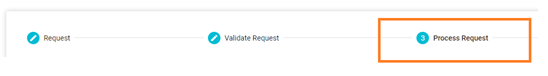
  

-	If the request is set to Automate, then as per the DSAR Workflow, the request will be sent to the respective users as an action item.

-	The Process Request Phase consists of 3 parts (Manual Processing)

    - Analyse
    - Plan
    - Act

-	**Analyze:** This page displays the Requestor Identity on the left and the ‘Validate Request’ Action Item Responses i.e., the responses from the users when they were asked to validate the Action Item, on the right. 
 
  

    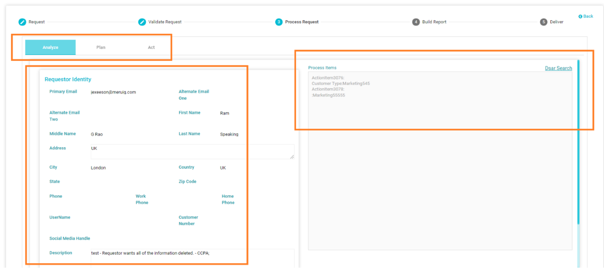
  

- **Plan:** This is where you can select the system required to process the request and create a new system based action item. For example, if data must be deleted from the LinkedIn system, you can select LinkedIn here and add the other necessary details for the Action Item. 

    - To do this, you will need to click on the  button to add the system to the Plan
   
      

        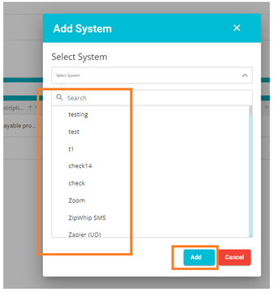
      

 

    - Once you click ‘Add’, the system you added will be shown in the process items table.
   
      

        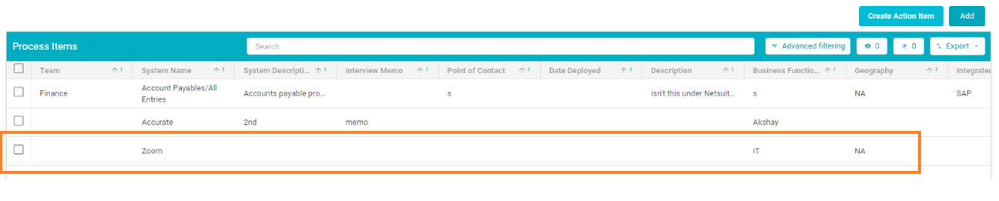
      

    - The first field on the table is the check box. You can select single or multiple systems and click 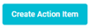   to add the selected systems to your Action Item
   
      

        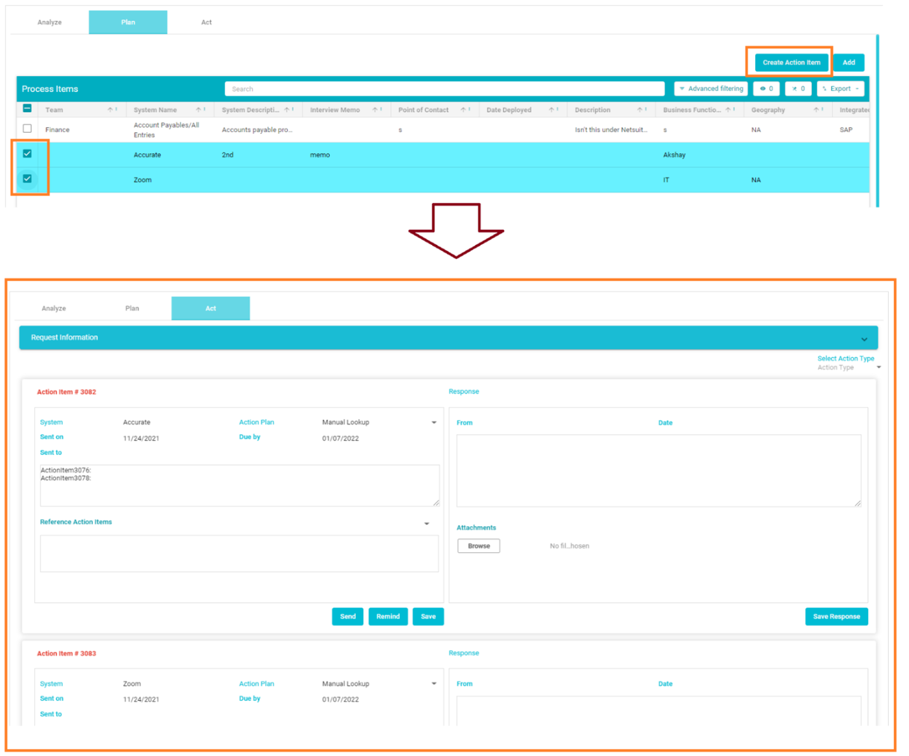
      

    - On clicking ,   you can assign the action item to a specific user
   
      

        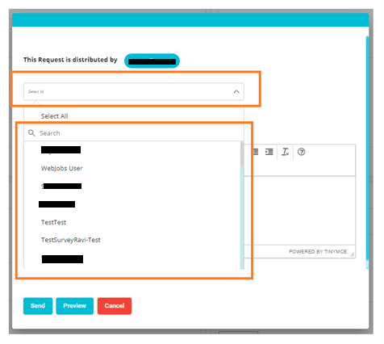
      

-	**Act:** This page will help you to send, remind, submit and view responses to the Process Action Items
   
    

      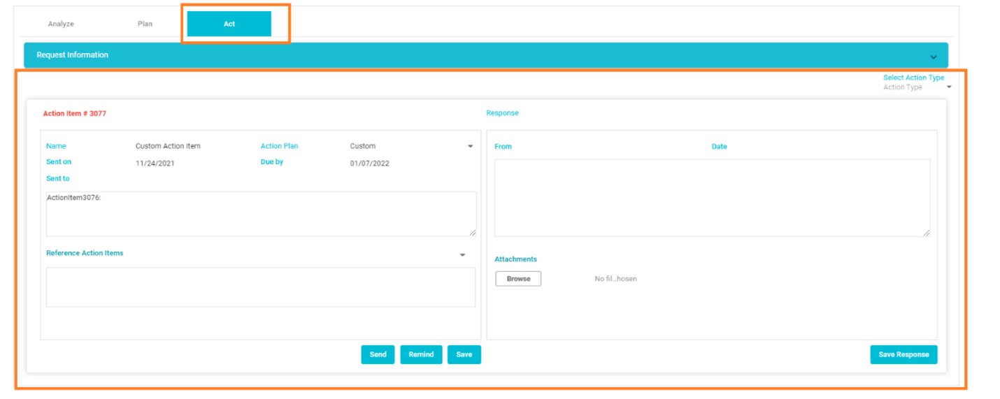
    

    -	Based on the responses from the Action Item, you can complete the requests as well (Specific request types) by going back to the Validate Request Phase to  ‘Acknowledge’, from where the required emails can be sent out 
   
      

       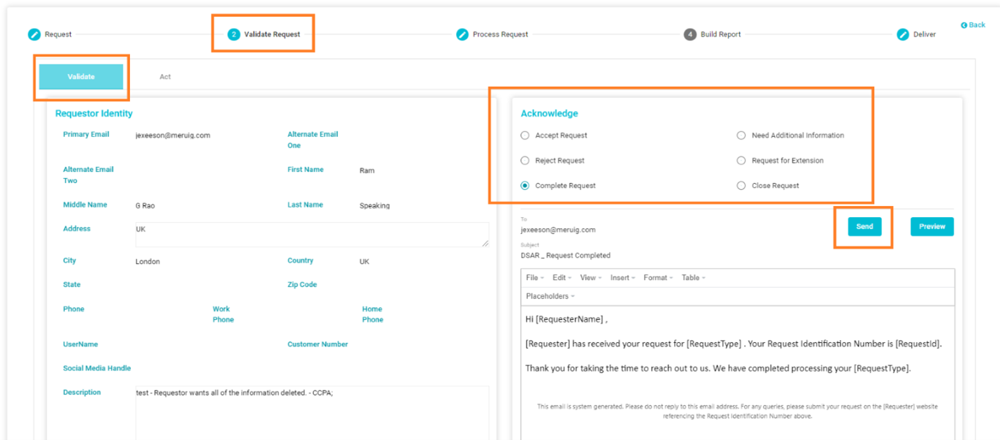
      

> ### 4.	Build Report

  -	There are two DSA request types that require submitting a report to the requestor. They are **Summarized Categories of Information** and **Copy of Information**. The reports to be submitted here contain the information your company has on the customer, which they request to gain access to. The report can be built by attaining and compiling the requestors information from the company database

  -	Here, based on the request, the respective Report must be preformatted and attached on this page to be sent to the requestor. 
 
      

        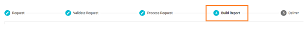
      

-	On the Build Report Page, you will find the details of the requestor. On the left you will find the Request ID, the status of the request, the option to see the history, etc. 

-	A pre-formatted report must be created for your end as per the requirement

-	Once the report is built, you can attach the document under **Report Attachments** which is at the bottom left of the page
 
      

        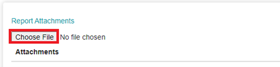
      
 

-	On clicking **Build Report**, you will get a pop-up message as shown below.
 
      

        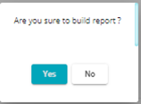
      
 

-	Click “Yes” 

> **Note:** The file that you have uploaded will be converted to an encrypted zip file

> ### 5.	Deliver

-	The Deliver page is used to send the report that was built in the Build Report Page

-	Go to the “Deliver” page
 
      

        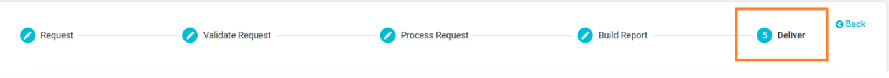
      
  

-	The page will show a pre-formatted email template, which has been configured via DSAR Configuration

-	The pre-formatted email can be edited on the delivery page as well.

> Note: The report will be shared through a secured link which will be in the email sent to the requestor when you click ‘Send’. At the same time, the system will send a password to access the report in a separate email

-	Use the **Preview** option to see how the email appears on the requestor’s end and **send** the response
 
      

        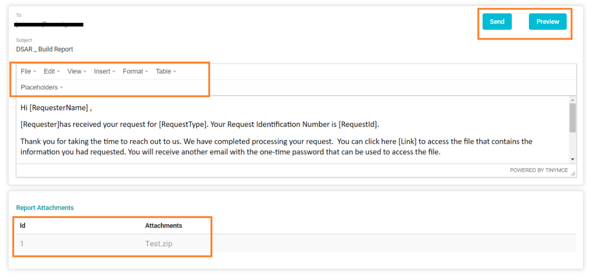
      
  

 

