

  

[Back](../../Products.md)

# Data Map

## What is a Data Map? 

The Data Map provides a comprehensive footprint of the data and data-related processes across the organization. It is a catalog of what data is created, how it is classified, where it is stored and how it travels within and outside the organization. A Data Map contains information about all systems within the organization and how data flows from one system to another. 

## Why do you need a Data Map? 

An efficient Information Governance (IG) program requires an organized, consistent, repeatable and documented process for governing data. The Data Map is a foundational element that underpins governance and brings together all the stakeholders of the program.  

## Meru’s Data Map 

Meru’s Data Map enables information about data, systems, and data flow to be maintained and updated with minimal effort from users by utilizing powerful automation capabilities. Our Data Maps allow different stakeholders and teams within an organization to easily see and understand how their data is used.  

>### *A typical Data Map captures many attributes as illustrated in the picture below:*
  
  

      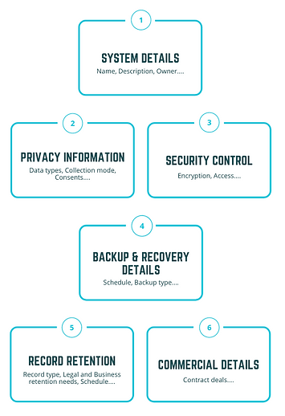
  

> ### **What you can achieve with Meru’s Data Map:** 

- **Data Classification:** Proper classification of the data helps organizations understand what is important, sensitive, and confidential. It is also helps in identifying duplicate copies of data. With AI-powered data cataloguing and classification tools, Meru’s Data Map automates the classification and organization of data within the Data Map. 

  ***Data Types***
  

      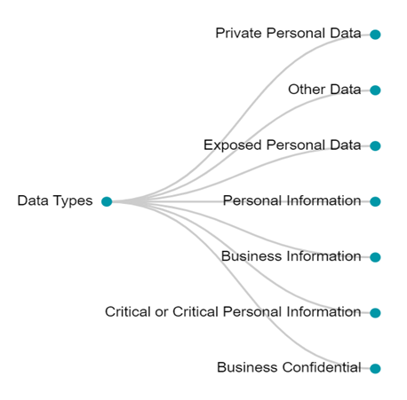
  

- **Risk Assessment:** Our Data Maps are also used to track and manage risk around data and data flows. With a clear representation of the entire data footprint, you can gain a complete understanding of the actual risks for the data. This ensures that the more important and confidential data is safeguarded with the best tools and mechanisms.

  ***Sensitive Data***
  

      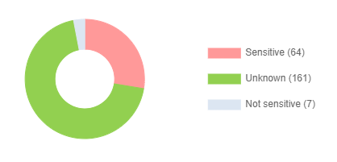
  

  ***Vendor Risk***
  

      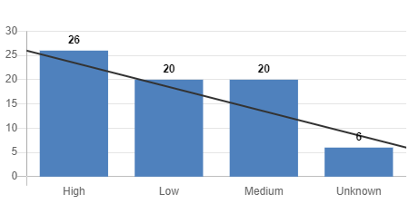
  

- **Better Accountability and Ownership:** An effective data map enables all critical stakeholders to work together for the successful implementation of the governance program. Proper collaboration ensures alignment, accountability and ownership within the team.

- **Data Minimization:** Detailed mapping will help develop a plan that can be actioned upon. Our automated data mapping and continuous rule-based monitoring tools create an actionable set of plans from the inventory and the retention schedules.

- **Retention:** An exhaustive Data Map can provide guidance on what aspects to consider for your retention policy and schedule. The more you know about the existing data, the easier it will be to prepare an accurate policy around it.

  ***Data Retention***
  

      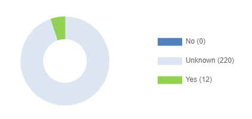
  

## Data Map Basics

On the Data Maps Homepage shows the detailed descriptive list of the Application or Systems. This information is initially displayed in table view with a default list of fields available for viewing.  

  

      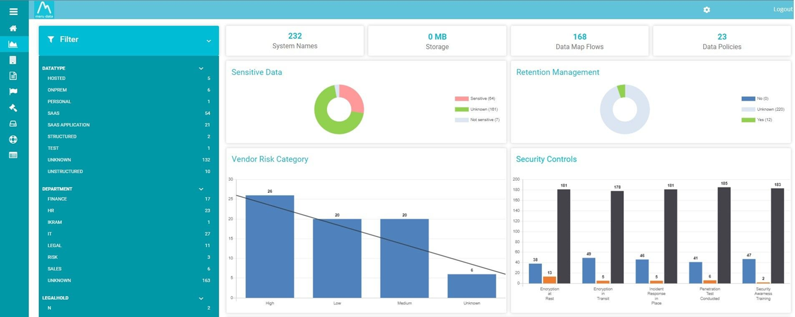
  

## Data Map Details

Additional information about the data element can be found within the System Details. For example, we will open detailed information about a particular System.

  

      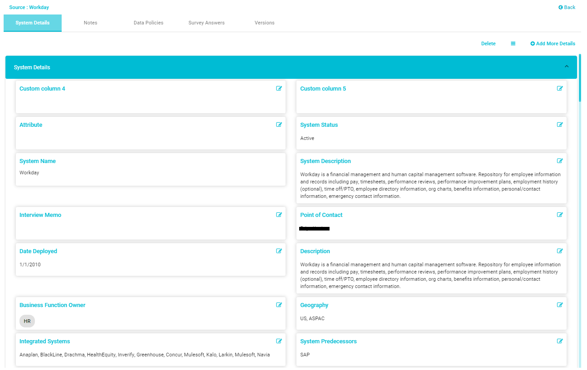
  

Now, you can see the details that were captured about a particular system like date deployed, system description, system owner, etc. Scroll down to see additional details of the system. You can store as many attributes as possible about the system and group them into categories.

**Example:**

- System Details
- Privacy
- Security
- Backup
- Retention
- Discovery
- Vendor Statements

You can also capture and store vendor policies, contracts, notes from past discussions, interviews, data policies, etc.

You can edit the layout of the Data map details as well. 

## Maintaining the Data map

> It is critical to use a tool to keep the map current and relevant. 

### The tools can help in the following ways:

1. Automated “what changed” audits are the most common way to keep the maps up to date. When sending the Surveys, instead of asking all the same questions again, a best practice is to prepopulate the questions with previously known answers. This will allow the users to just edit what’s changed or confirm that everything remains the same.

2. Ongoing PIA and Risk Assessments on new projects will also help maintain the data map by ensuring that all the potential areas of risk are addressed.

3. Ongoing Vendor security reviews will provide information that will maintain the Data map.

4. Automated APIs or other scanning tools should be deployed in parallel to detect any changes in data and update the Data Map as required.

## How the Data Map works

A Data Map captures several attributes pertaining to different aspects of the data, including, the system it is stored in, its privacy information, security control, backup and recovery details, records retention, and commercial details.

  

      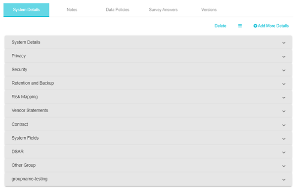
  

The details for these attributes are used to identify the type of data present in the system and what security and privacy controls are needed for its protection.
The first step is classification of data based on its criticality to business operations and level of risk. This categorization helps to determine the type of controls that needs to be implemented and to ensure that the implemented controls are adequate for the inherent data risk and the criticality of the system.

In addition, you can also apply certain policies to systems based on the type of data they store. These policies can include conditions around encryption, permissions, labeling of data, etc.

  

      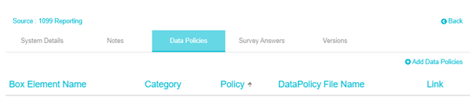
  

## Data Map Flows

Effective data governance depends on the understanding of where the data resides, where it flows, what type of data is being transferred, and where there are intersections with different data networks. This knowledge helps in implementing the necessary controls to govern the data and in ensuring compliance.

For instance, details regarding the source and destination of data are useful in keeping track of cross-border data transfers and data residency requirements. Tracking the flow of data also enables easy implementation of zero-trust networks and other security measures.

**Data Map Flows** represent how the data is flowing across the various systems and the path of the data being transmitted from one system to another.
 
  

      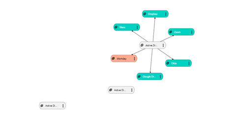
  

Each datamap flow record gives a pictorial representation of the systems and the transmission of data among them. It shows the type of data that is being transmitted, the transfer type and frequency of transfer.
 
  

      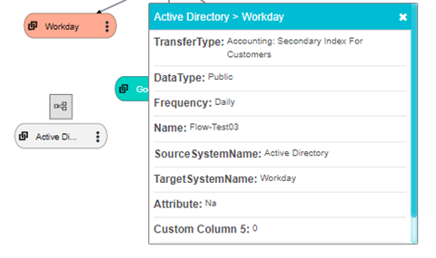
  

Information regarding the processing activity, region of use, business function owners, system owner and system category is also displayed for each system.
 
  

      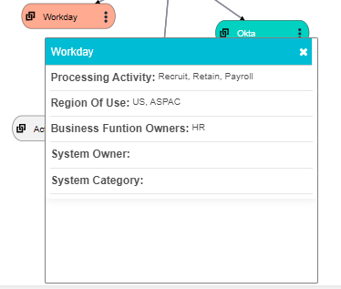
  

This makes it easier to track the data flow and monitor the systems and the data sharing among them.
