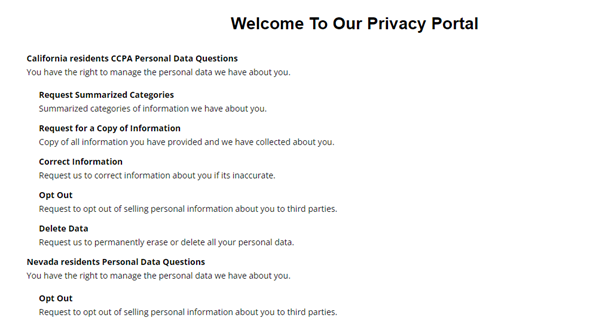
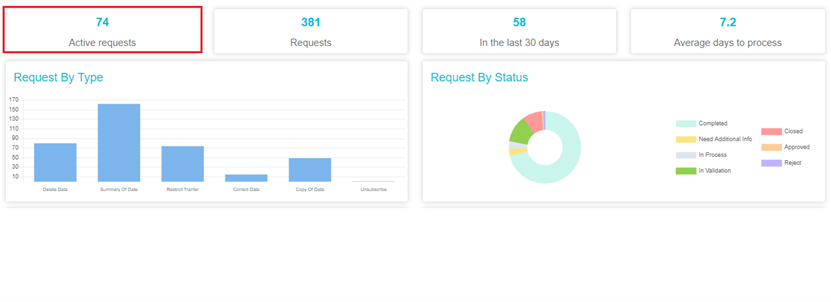

  

[Back](../../Products.md)

# Managing Subject Access Requests 

## What is a data subject access request? 

Privacy regulations provide certain rights (data subject rights) to individuals for giving them control over their personal data. These rights can range from right to access, deletion, correction, opt-out, right to be forgotten, etc. Individuals also have the right to know and obtain information about the purposes of personal data processing. A data subject access request (DSAR) is made by an individual to an organization to exercise any of the above-mentioned rights.  

DSARs can be submitted in different ways, including over the web, in writing, or verbally over the phone. The California Consumer Privacy Act (CCPA) requires that businesses help consumers exercise their CCPA rights by providing two "designated methods for submitting a request." Meru’s DSAR solutions allow organizations to add a toll-free number for individuals to submit DSARs. 

### **Types of data subject access requests include:**

> **Limit/Restrict/Opt-Out:** Requests to restrict sharing of individual’s information with affiliates and partners or limit the use of their personal data

> **Summarized Categories:** Requests for summarized categories of information an organization has about individuals

> **Copy of Information:** Request for copy of all information organization has about the individual

> **Update/Change/Collect Information:** Request to change/update information about the individual, particularly if it is inaccurate

> **Delete Data:** Request to permanently erase or delete an individual’s personal data

## Processing of DSARs 

To process the DSARs, it’s essential to first account for all the data belonging to each user. This means being able to identify all data stores and applications, identify what data is personal, to whom it belongs, etc. 

Personal data is often stored across different systems within an organization, in the cloud, and also with external vendors and partners. A current and comprehensive Data Map will help streamline this process. Meru’s DataGovernance Tool integrates with the Data Map to identify the type of data, its location, to whom it belongs, etc., which helps in the swift fulfillment of requests. 

Our tool can quickly create and automate workflows within your organization for processing DSARs. Meru’s built-in customizable workflows and automated APIs can collect or delete necessary personal data from multiple systems. This ensures timely responses to customer requests in a secure manner and increased efficiency for managing requests. 

The workflows can also assign specific tasks that need to be handled manually or via API to individuals and third parties. Responses to certain questions can trigger additional workflows or alert process owners of potential issues ahead of time. 

## How Meru’s application works 

- Meru Data’s automated DSAR workflow consists of four key steps:

  

    
  

- All DSAR requests are submitted through the form on the website privacy portal or the IVR (toll-free number)

  

    
  

- All active requests appear on the home screen as shown below:

  

    
  

Meru application provides a seamless platform to verify user requests, automate responses, standardize tasks, gather relevant data for processing the requests, etc. Meru's tool automates DSAR responses and recurring trivial tasks within the system. Our API integrations and workflows enable effortless tracking and on-time responses to search, delete, and opt-out requests.