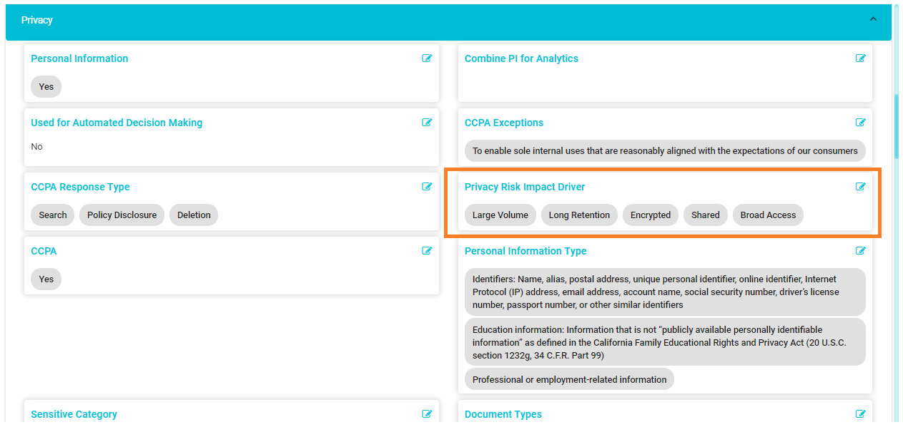

  

[Back](../../Products.md)

# Privacy Impact Assessment

A Privacy Impact Assessment (PIA) is an analysis of how personally identifiable information is collected, used, shared, and maintained within the company. The purpose of a PIA is to demonstrate how privacy protections have been consciously incorporated at the system level and across the company throughout the information life cycle. The PIA captures potential risks or vulnerabilities and the likelihood of these vulnerabilities to occur in a system.  

The PIA includes the maintenance of a Privacy Risk Register that provides an overview of the risks across all the systems. Maintaining a Privacy Risk Register and evaluating overall privacy maturity help in measuring and managing the privacy and data ethics within the organization.

## What is Privacy Risk Impact?

The PIA is based on the privacy impact drivers for each system or process. Privacy Risk Impact Drivers are the attributes of a system that contribute to the privacy risk in a system. These include the volume of personal information on a system, retention periods, access, storage method, and controls.

## Meru’s Privacy Impact Assessment 

The Meru Data Map captures the Privacy risk impact in two fields: **Privacy Risk Impact Driver** field and **Privacy Risk Impact** field.  

The Privacy Risk Impact Driver field is populated based on information about systems that is already present in the Data Map or can be collected from surveys. Integration with the Data Map enables  easy calculation of the PIA based on the information available in the Data Map.  

The Privacy Risk Impact Drivers are tracked in the Data Map, and an overall Privacy Risk Impact is auto calculated for the system based on the Privacy Risk Impact Drivers.  

The Privacy Risk Impact is a numeric value based on an impact score for each Privacy Impact Driver. The impact score helps with risk management by assigning a single score, a number, or a rating, to identify the level of risk associated with a system. Assigning scores helps improve visibility into the risks and the controls in place for managing these risks. 

  

      
  

## Privacy Risk Register

The Privacy Risk Register gives an overview of the risks across all the systems. The Privacy Risk Register is maintained in the Data Map, with a typical risk register containing the following (with an option to customize them based on the organization’s needs): 

- **Potential Risks:** The potential risk or vulnerabilities that the organization can be exposed to. 

- **Risk Likelihood:** The potential likelihood of risks to materialize.

- **Risk Severity:** The highest level of damage possible when a vulnerability or a risk occurs. 

- **Risk Impact Score:** Overall score for each risk. This will be based on the severity and likelihood. 

- **Type of Impact:** Potential types of impact to the organization if the risk materializes. This can include Loss of Trust with customers, Economic Loss, Reputational Loss, Civil liabilities, Regulatory action, etc. 

- **Controls Implemented:** Actions and Privacy Controls that lessen the probability and/or negative consequences associated with risk. 

- **Risk Owner:** The person responsible for accepting, managing, or mitigating the risk within the company. 

- **Risk Priority:** Each risk is classified into different Risk Priority levels based on the risk impact score and type of impact. 

&nbsp;

>### ***Four commonly used Risk Priority levels are:***

- **Avoid/Reduce:** Risks to be absolutely avoided or significantly reduced by implementing controls that reduce both their impact and likelihood.

- **Revisit:** Moderate risks that are of lesser priority, and the organization chooses to devote fewer resources to addressing them currently.

- **Accept:** Risks that are accepted without further control implementation, especially if the treatment of other security or privacy risks also reduces this risk.

- **Transfer:** Risks for which responsibility can be transferred to another party that can accept and better address the risk and/or has the resources necessary to properly mitigate the risk.