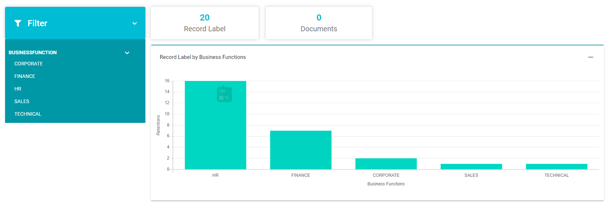
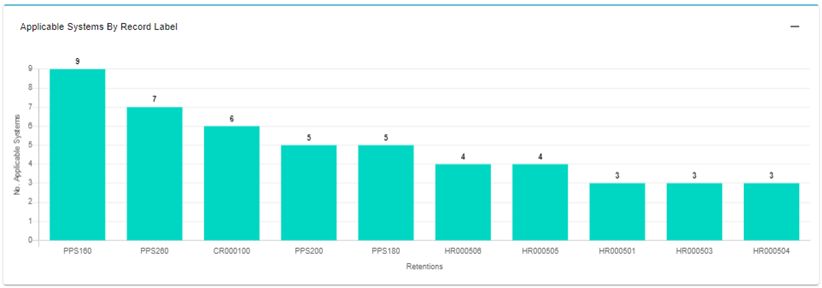
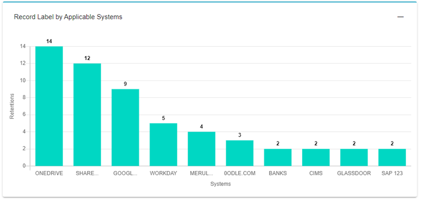
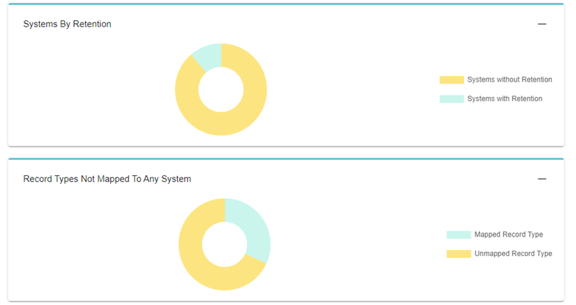
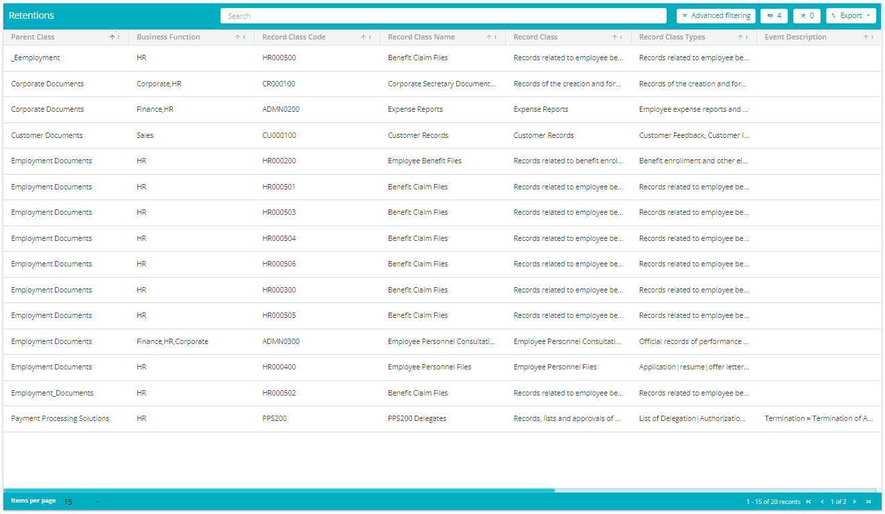

  

[Back](../../Products.md)

# Retention Management 

## What is data retention? 

Apart from properly governing and managing the data, it is also important to dispose of the data after its useful life. A data retention policy defines the legal and operational requirements of a particular type of data. Following a retention schedule ensures the regular disposal of data that doesn’t hold any business or regulatory value. 

## What is the need for retention management? 

Regulatory environments are constantly changing with the increasing focus on data and privacy. The worlds of records, data, privacy and security are intertwined and need to be managed more carefully. Defining the retention period is a key aspect of comprehensive data lifecycle management. Well-managed retention processes will be in concert with data classification efforts and will allow flexibility to attribute deletion periods based on the type of data, business and regulatory requirements. 

## Meru’s Retention Management System 

Meru’s retention management system allows you to define and govern your retention needs. Meru’s application has automated tools to facilitate auto-classification of data, which allows retention policies to be actionable and dynamic. Retention schedules can be associated with data sources and incorporate requirements by jurisdiction. 

Our tool facilitates compliance with regulatory requirements, deletion of ROT data, improved security and reduced costs. 

- Comply with Regulatory Requirements: Regulatory requirements often immediately drive the retention of data. Several privacy regulations have emphasized the importance of having a comprehensive retention plan for sensitive personal information. 

- Reduce ROT: Identifying and deleting redundant, obsolete or trivial data that gets generated routinely will help us to focus on data that matters. 

- Security and Costs: Timely disposal of unwanted data considerably improves the security posture of the company. It drives significant reductions in eDiscovery costs, storage and licensing costs. 

## How it works 

You can import your current retention schedule and link it to the Data Map. Click on the "Retention Management" graph to see the detailed retention policy. 

  

      
  

  
  

      
  

  
  

      
  

  
  

      
  

  The retention policy details are displayed below:
  
  

      
  

  Click on the row to see the details.
    
  

      
  

  Navigate to the Citations tab to see the Citations related to the Record Class Code.
    
  

      
  

  Click on the Citations to see the details.
    
  

      
  

