

  

[Back](User_Guides.md)

# How to process a Data Subject Access Request (DSAR) - User Guide

## Submission of Request

All DSA requests are submitted through the form on the website privacy portal or the IVR (toll-free number).

Under CCPA, California residents can make the following requests: Summarized Categories of Information, Copy of Information, Opt-Out, and Delete Data

Nevada residents can make Opt-Out requests 

Data Governance Tool users are generally assigned Action Items by their respective Admins when a DSA request comes in. This guide demonstrates all the steps involved in processing a DSA request from the user's standpoint.

  

    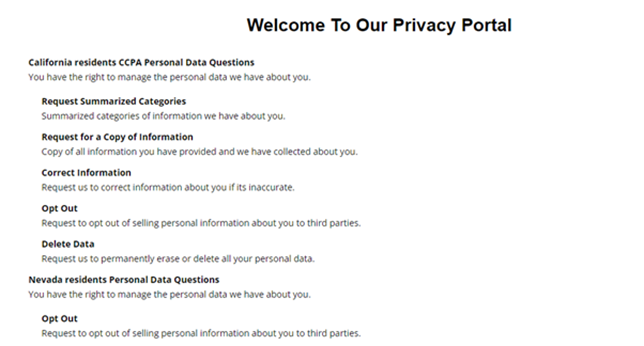
    

-	Once the requestor submits a request, the request will flow to the Data Governance Tool under the DSAR Option.
-	At the same time, an email will be sent to the requestor to verify the primary email address provided in the request submission form

> **Note:** The request is saved temporarily until the web job runs. This happens automatically every hour. The web job will move the request that was temporarily saved to the processing automatically.

-	Once the request is moved to the processing queue, the DSAR configuration created by your admin will start running. As per the instructions, the request will be sent to the respective users for processing as action items. The admin can also manually create action items if required.

### Request Processing is categorized into:

- Validate Request
- Process Request
- Build Report (only required for a specific type of request)
- Deliver

-	There are only 2 categories wherein the user will be involved. They are - **Validate Request** and **Process Request**

## Validate Request

Validation of Request is a step in processing the DSA request that involves matching the requestor's details against the customer master database to consider it a valid request. The request can be processed if the requestor details are found in the database; otherwise, additional information is needed.

-	Once the request is in the In Validation state, the specified user to whom the task has been assigned will receive an email directing them to the Action Item 

    

      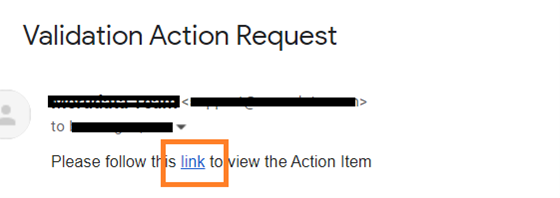
    

-	Click on the hyperlink, and it will directly take you to the Data Governance Tool Login page

    

      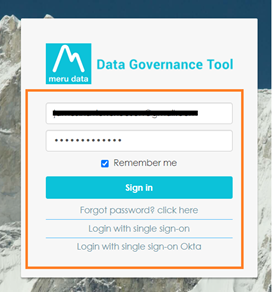
    

-	Once logged in, you will be directly taken to the action item page for the respective action that you have been assigned.

    

      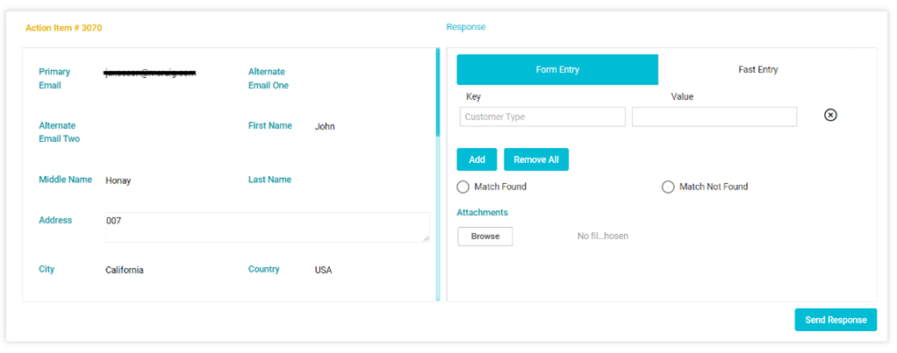
    

-	Or You will be able to access all Action Items assigned to you at the My Action Items field, at the bottom of your Main Screen.

    

      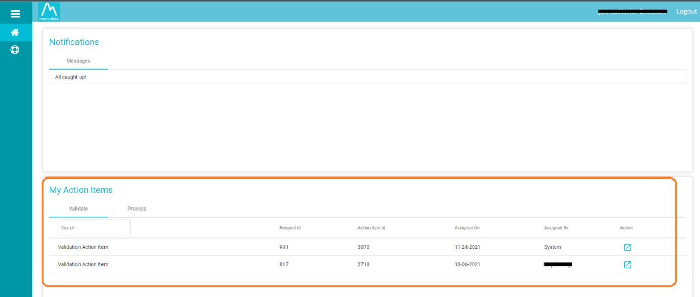
    

-	The Request Validation page shows the requestor's details along with the description of the request, date of request, due date, and who the request was sent to.

-	Your Response to the Action Item is to be added under the Response pane on the right side of the page. 

    

      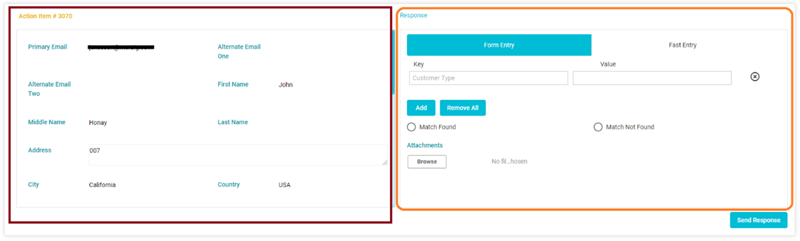
    

-	The Response can be provided in 2 ways, either using Form Entry or Fast Entry

  - **Form Entry:** This is done when the admin has pre-created the Keys needed for the action Item, and you will need to mention the required details in the value filed

    

      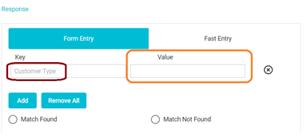
    

  - E.g., Customer Type or Client ID - information pertaining to the requestors that enable users to identify the requestors' details from the company database easily

    - You can add more Keys by clicking 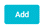 it can also be used if you have received more details about the requestor from the company database. To remove the key you can click on the  or by clicking .

    

      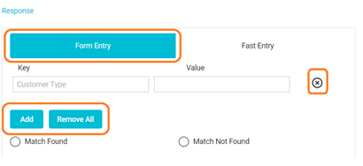
    

  - **Fast Entry:** Here you can manually enter in the requestors information in the box provided while you check said information against the company databse.

    

      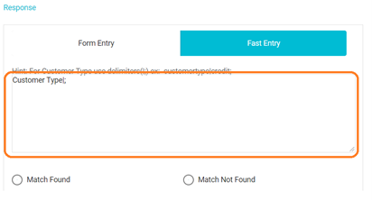
    

  -	If you could not identify any details from the company database with the provided requestor's information, you need to check the "Match Not Found" option and click 'Send Response'
 
      

        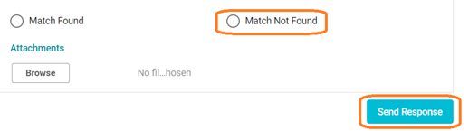
      

  -	In the scenario where you were able to identify the details from the company database with the information provided by the requestor, you must provide the Key Values and any other additional information in their respective fields. Then check the "Match Found" Option 

      

        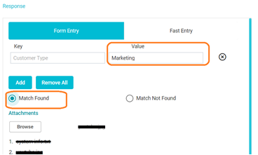
      

  -	You may also add attachments to your Response that would be useful in processing the request (optional )

    

      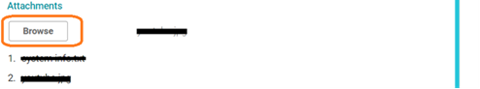
    

  -	After filling in all the information, click .

## Process Request

  -	Once the request is in the In Process Request state, you will receive an email that contains a link.
  -	Clicking on said hyperlink will take you directly to the Data Governance Tool Login page
 
    

      
    

  -	Once logged in, you will be taken to the action item page for the respective action item that you have been assigned

  -	Or You will be able to access all the Action Items assigned to you at the My Action Items field, at the bottom of your Main Screen.

    

      
    

  -	The Action item page will show all the Requestors and Request details 

    

      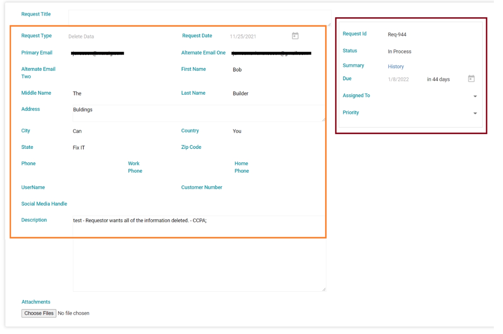
    

  -	On scrolling down, you will be able to see the action item assigned to you

  -	Based on the request type, you will need to process the action item.

## How to process the action item?

  -	Once the requested action is completed from your end, you can mention the comments in the "Response" field

    

      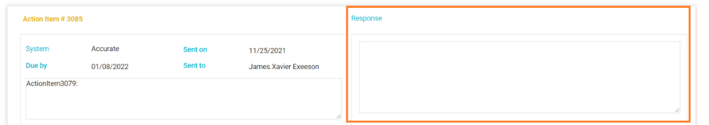
    

 
-	For the Request Types: Summarized Categories of Information and Copy of Information, then you will need to create a preformatted report

-	Once the Report has been created, you can attach the document in the attachments field

-	After filling in all the information, click .  

    

      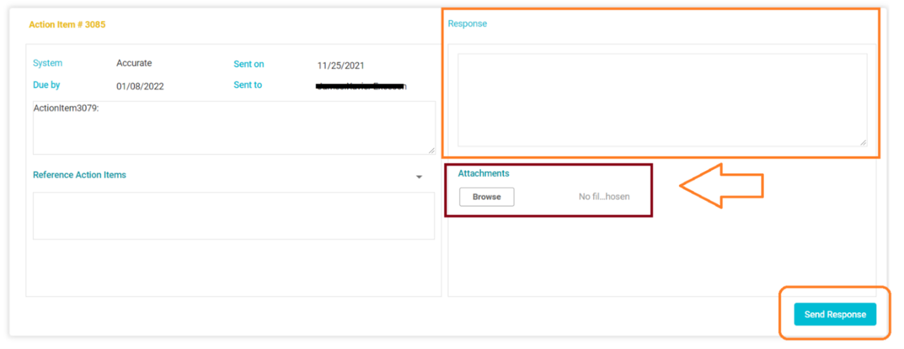
    

